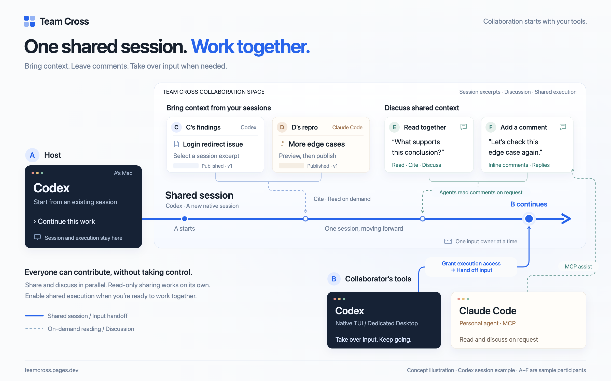

# Team Cross: **Collaborate with the tools you already use.**

[简体中文](README.md) | **English**

Team Cross is an open source collaboration tool for coding agent sessions on macOS. Select and preview material from your existing Codex or Claude Code sessions, then invite teammates and their agents to read, reference, and discuss it. When you need to work on the code together, create a new native collaboration session, explicitly grant execution access, and hand over input.

Keep using your familiar terminal and native clients, with an optional WebGUI for shared context. Collaboration spaces and shared execution are hosted on the initiator's Mac. Each person's agent participates through MCP on request, keeping its own session, model, and local context.

[Interactive demo](https://teamcross.pages.dev/en) · [Download v0.2.5](https://github.com/YTwsy/Team-Cross/releases/tag/v0.2.5) · [User guide](docs/user-guide.en.md) · [Documentation index (中文)](docs/README.md)



## Start with work already in progress

“Can you take a look at this session?” You can start by sharing an investigation or ask a teammate to continue ongoing work. A Team Cross space supports three or more participants, each with their own identity and the ability to contribute multiple pieces of material.

**Your session can be your question or your answer.** During a code review or bug investigation, teammates can follow the conversation to see what background was provided, which code was checked, which edge cases were considered, and which conclusions were verified.

| What you want to do | How to participate |
| --- | --- |
| Take a look and give feedback | Read the content a teammate chose to share, then annotate and reply alongside the original text, without taking control of input |
| Bring your own investigation | Select an excerpt from your own session, preview it, and publish it to the same space; discussions reference specific versions |
| Bring your own agent | Ask your personal Codex or Claude Code agent to read material, check the evidence, and reply through MCP |
| Take over and continue | After receiving execution access and an explicit input handoff, operate the shared session in its native client; execution stays on the host Mac |

Take an issue with event tracking in a frontend app. It may involve how the backend passes down trace IDs, how the native app processes events, changes in a cross-platform container, and the data warehouse's ingestion requirements. You also need to understand what the product team wants to measure. The person investigating may only have part of that context. Share the session where you started investigating, let backend and client engineers contribute their material and product teammates add business context, then ask your agents to read, check assumptions, and bring findings back to the discussion.

The same approach helps when a product colleague builds a small feature with AI and needs an engineer to check its implementation and impact, or another business team needs to understand logic in your codebase. Start with shared session material, then explicitly grant execution access when further hands-on work is needed.

## Install

The current stable release is **`v0.2.5`**. Choose one installation method:

| Method | Install and open |
| --- | --- |
| Download the app | Download the [Apple Silicon DMG](https://github.com/YTwsy/Team-Cross/releases/download/v0.2.5/Team-Cross-0.2.5-arm64.dmg), drag `Team Cross.app` into Applications, and open it |
| Homebrew app | Run `brew install --cask YTwsy/teamcross/team-cross`, then open the app or run `teamcross` |
| Homebrew CLI | Run `brew install YTwsy/teamcross/teamcross`, then run `teamcross` |

You do not need Go, Node, or pnpm to run an installed release. The app bundles the CLI and local service. DMG users can install the command through **Command Line Tool…** in the menu bar. Reading published material does not require Codex or a local repository.

The current package is ad-hoc signed, without a Developer ID signature or Apple notarization. If macOS blocks the first launch, try opening the app, then follow [Apple's instructions](https://support.apple.com/en-us/102445) to allow it in **System Settings → Privacy & Security**.

Quit Team Cross before upgrading, then update through the same installation channel. Installation preserves collaboration data and working directories, but **`v0.2.5` does not load or migrate old `schema:2` material; that data remains on disk**. Stable and RC Homebrew channels are maintained separately, and ordinary upgrades do not switch channels. Uninstall the previous channel before changing installation methods.

See [installation and upgrades](docs/user-guide.en.md#install-and-upgrade) for channel-switching steps, and the [release](https://github.com/YTwsy/Team-Cross/releases/tag/v0.2.5) for changes, CLI downloads, checksums, and provenance.

## Get started

Open the menu bar app, or run:

```sh
teamcross
```

Both `teamcross` and `teamcross serve` start or reuse the local service, open the browser, and return control to the terminal. The host must keep Team Cross running so teammates can connect. Closing the browser does not stop the service.

The menu bar and WebGUI follow this Mac's preferred language by default: Chinese uses Simplified Chinese, and other languages use English. Choose **Follow System**, **Simplified Chinese**, or **English** from the menu bar's language menu or **Settings and Connections → Interface language** in the WebGUI. A manual choice applies to both interfaces on this Mac. Session text, user input, and protocol fields are not translated.

### Share and discuss first

1. Choose **Start a space → Share and discuss first**, then search for and select your source session.
2. Use **Start from this round** and **By the end of this round** alongside the conversation to select complete turns. Click **Preview shared content**, review the selected text, tool activity, and export notes, then create a read-only space.
3. Choose LAN or Tailcat, generate an invitation link, and send it to your teammates. The same link can be used by multiple people, and each person can publish material, annotations, and replies.

Read-only sharing does not create a native fork or grant access to the execution directory. Later conversation content is not automatically published. Authors must preview and explicitly publish a new version to update material; existing annotations and references keep pointing to the version they discussed. Withdrawing material stops future reads but cannot take back content that has already been read.

Material supports Markdown, code highlighting, annotations alongside the original text, and references to fixed versions. Long tool output expands on demand, and the conversation directory can load and locate turns that are not yet displayed. Readers can see the source and published scope. See [sharing and review](docs/user-guide.en.md#share-and-review) and [reading and annotations](docs/user-guide.en.md#reading-and-annotations).

### Continue with shared execution

1. Choose **Enable shared execution** in an existing space, or **Start a space → Execute directly together** on the home page.
2. Confirm the source session, execution directory, and permission mode to create a new native collaboration fork. Use the existing directory or create a new worktree from the selected `HEAD`.
3. Grant execution access to specific members and explicitly hand over input. The teammate can continue in the corresponding native TUI or dedicated Codex Desktop, then hand input back when finished.

Enabling execution preserves the space's link, members, material, and discussions. **Granting execution access shares the full native history and working directory; control of input is handed over separately.** The original read-only invitation continues to grant only material and discussion access. Multiple people can read and discuss at once, while shared execution has one input holder at a time.

Using the original directory preserves its Git branch, staging area, and existing files. A new worktree is checked out from the confirmed `HEAD` and does not copy uncommitted changes. Ending sharing preserves the session, code, and working directory, and you can later resume the same fork. See [execution and directory choices](docs/user-guide.en.md#continue-with-shared-execution) and [ending and resuming](docs/user-guide.en.md#end-and-resume-sharing).

### Join an invitation

Install Team Cross, then open the `teamcross://` invitation link or paste the invitation code into **Join a space**. Review the collaboration name, host, and access scope before joining. You can also use the terminal:

```sh
teamcross join 'INVITATION_CODE_OR_FULL_LINK'
```

Closing or resetting an invitation link does not remove existing members. The host can revoke an individual member's access. A temporary disconnection does not mean the member has left; see [invitations and joining](docs/user-guide.en.md#invitations-and-joining) for reconnection and departure rules.

## Bring your own agent

The WebGUI is optional. Your personal Codex TUI/Desktop or Claude Code TUI can use Team Cross MCP to publish material, read context, and participate in discussions when you ask. Equivalent CLI entry points are also available.

In **Settings and Connections**, select Codex or Claude Code and connect the local client. Reconnect MCP or reopen existing clients afterward. You can also run the configuration command using the full path shown on the page; see [personal agents and MCP](docs/user-guide.en.md#personal-agents-and-mcp).

Once connected, you can ask:

> “List the material in this space, read the version referenced by this annotation, check it against our project conventions, and reply to the original annotation.”

Each personal assistant session runs on its user's Mac and makes its own model calls. Tasks sent to the shared session execute on the host Mac. Saving an annotation does not automatically send a task to the shared agent; you must explicitly ask it to read and act on the discussion.

When you operate a shared session directly, its native runtime already provides tools for the current space's material and annotations. There is no need to install the personal assistant MCP separately for that session. See the [user guide](docs/user-guide.en.md) for the differences between entry points.

## Pick up earlier work on your own

That context remains useful when you work alone, too. The **Library** lets you revisit session material, annotations, and execution context from work you previously shared or participated in. Ask your current agent to read selected context, cross-check findings and decisions across sessions, and pick up work you already started.

Select the content you need in the library, generate a local read ID, and give it to your personal agent. Selections from the same space can also be previewed and sent to its shared session. Left-click the menu bar icon or press `Control + Option + T` to open the quick view and switch between **Current spaces** and **Resources**. See [the library and quick view](docs/user-guide.en.md#library-and-quick-view).

## Hosted on your Mac, connected when needed

Teams already have working directories, terminals, and agent configurations. Asking a teammate to review a problem should fit into work already in progress. Team Cross starts with existing sessions and transcripts so people can keep their familiar tools, with the WebGUI as an optional entry point.

A centralized cloud service requires teams to assess how code and business context are handled, while an internal deployment adds setup and maintenance. Team Cross hosts collaboration spaces and shared execution on the initiator's Mac. Connect directly on the same local network, or choose experimental Tailcat for connections across networks where your team's network policies allow it. Participants need Team Cross installed, with no separate Team Cross account to create or centralized collaboration platform to deploy.

Local hosting describes the collaboration service and where execution runs. Each agent still makes model calls according to its selected provider's configuration.

## Current support

| Area | Scope |
| --- | --- |
| System and distribution | Apple Silicon, macOS 14+; app and CLI; no Intel builds, automatic updates, or launch at login yet |
| Direct Codex operation | Native TUI and a Codex Desktop dedicated to collaboration; the personal Desktop and dedicated window serve different purposes |
| Direct Claude Code operation | Experimental native TUI; follow-up input, interruption, approvals, and model selection happen in the native TUI; no Claude Desktop integration |
| Personal agents | Codex TUI/Desktop and Claude Code TUI participate through MCP and can assist a collaboration using a different provider |
| LAN | Participants must be mutually reachable on the same local network, with the host service running |
| Tailcat | Experimental; no Tailscale account or system TUN required; direct connections or DERP relay, with quality depending on the network and selected DERP |
| Execution directory | Ordinary Git repositories; use the original directory or create a new worktree; repositories with submodules are not supported yet |
| Models and reasoning effort | Inherited from the native source at creation, then follow the current input holder's selections in the native client; the product does not fix a model |

Shared execution uses **restricted mode** by default. Explicitly choosing **trusted mode** inherits the host's native configuration, tools, and permissions; tools may access data outside the working directory. The mode is fixed at creation and preserved on resume. See [collaboration modes (中文)](docs/agent-wiki/sources/decisions/runtime-modes.md).

LAN and Tailcat are selected explicitly and do not switch automatically. Invitations contain access credentials and should be treated as secrets. Native client interfaces may change between versions; other global Desktop features are outside the compatibility commitment.

Recorded tests on a single machine do not establish acceptance across two Macs, across networks with Tailcat, or with sustained DERP relay. See the [validation index (中文)](docs/agent-wiki/wiki/concepts/validation-gates.md) for the versions and environments actually covered.

## Product direction

Real work often means revisiting earlier steps. New findings can make us question whether we understood the requirements, check constraints we inherited from earlier decisions, or reconsider whether the current approach is worth pursuing. Knowing when to change direction still depends on people's experience and judgment.

A timely look from a teammate who knows the background can save an investigation from a detour. Team Cross focuses on helping those judgments happen when they are needed, so teammates can join work in progress with their own tools and agents. Fewer human interventions, on their own, do not tell us whether software development has become more effective.

We are also exploring ways for the agent on the host machine to invite a person when it needs human judgment. This remains a product direction: sharing, execution access, and input handoffs currently require explicit user actions.

## Development and documentation

Building from source requires Go 1.27.1+, Node 24+, and pnpm. Building the app also requires macOS Command Line Tools and Swift.

```sh
pnpm install
make build
./bin/teamcross serve
```

- [User guide](docs/user-guide.en.md): installation, upgrades, CLI and MCP, reading and annotations, input handoffs, and resuming work.
- [Development and validation (中文)](docs/development.md): local development, packaging, engineering checks, and real-model test entry points.
- [Agent Wiki index (中文)](docs/agent-wiki/wiki/index.md): product decisions, architecture, protocol, and validation records by version. Read [AGENTS.md (中文)](AGENTS.md) before contributing.
- [Documentation index (中文)](docs/README.md): find documents by use case.
