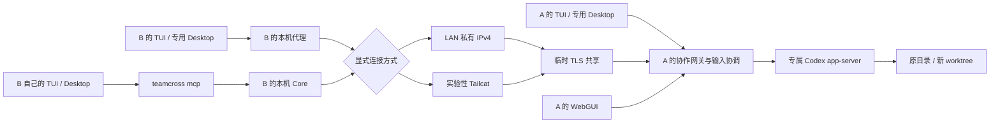

# 原生协作架构

本页保存当前架构的完整说明。按任务查找代码与边界时，从 [运行时架构](../wiki/concepts/runtime-architecture.md) 开始；具体字段和路由见 [协作接口](protocol.md)。

Team Cross 管理协作的来源、执行目录、原生 fork、邀请、输入归属与人工批注。模型上下文与工具执行由 A 上的 Codex app-server 持有。



## 模块

- `internal/workspace`：Git 预览、干净 worktree、子目录映射、文件读取。
- `internal/nativecodex`：启动和初始化独立 app-server，通过一个长期 WebSocket 进行 RPC、事件及 server request 分发。
- `internal/collab`：协作记录、原生协议网关、输入协调、邀请与加入、TUI/Desktop 启动、HTTP 管理接口。
- `internal/sharing`：`tcx3` 邀请、临时 TLS listener、指纹绑定，以及 LAN / Tailcat 服务端与客户端连接适配。Tailcat 只把虚拟 TCP 443 交给同一 TLS/HTTP 网关。
- `internal/mcp`：个人辅助 STDIO 与共享运行时批注 STDIO。后者只有当前协作的读取/回复工具和独立凭据，每次调用重新读取 Core 地址，不启动 Core 或复用管理凭据。
- `packages/web`：新 React/Vite 界面，生产资源编译到 `internal/webassets/dist` 后嵌入 Go 二进制。

## 原生运行时

浏览来源时按需创建只读用途的 app-server 控制连接；不会自动发送 prompt。每次协作有单独的 app-server 进程，以 A 的原生会话库读取来源并执行 fork。受限模式通过命令行参数覆盖原生配置；信任模式加载 A 的原生配置与权限，仅追加当前协作批注 MCP。两种模式启动时都不由 Team Cross 重写 A 的个人配置；信任模式中，当前输入者的原生 hook 确认由 Codex 写回 A 的配置。具体继承与生命周期见 [协作模式](decisions/runtime-modes.md)。

仅复制 rollout 文件无法替代原生历史数据库。协作记录保存 `sourceId`、已确认的 `sourceTurnId` 和新 `sessionId`。创建调用 `thread/fork`，使用 `lastTurnId` 保留确认过的已完成起点。恢复调用 `thread/resume`，继续同一 ID。

直接客户端的 `initialize`、会话枚举和请求都经过协作网关。网关只暴露指定协作；固定 `threadId` 与 `cwd`；受限模式固定权限 profile，信任模式沿用原生权限，并允许当前输入者通过原生会话设置选择权限。模型及推理强度继承原生来源和当前输入者的选择。网关与 MCP 共享同一个上游控制连接，避免审批只被某个连接收到而另一入口无法回应。共享仍开放时，直接客户端断开不会终止 app-server。结束共享后，执行、审批、已接收请求和直接连接全部结束才关闭该 Session 的 app-server，释放原生 writer lock；仅 `thread/unsubscribe` 不作为释放依据。关闭过程在会话锁外等待进程退出，恢复等待退出完成，旧进程通知按代次丢弃。

Desktop 使用本机安装版本的指定 WebSocket 入口，配合单独的 `CODEX_HOME` 与 Electron 数据目录，通过 `open -n` 启动。是否所有 Desktop 操作都适合远程执行需要按实际客户端版本验收；不能仅凭 app-server 协议相同宣布完整兼容。

客户端本机代理单独处理 `account/login/start`、登录完成通知、`getAuthStatus` 和客户端偏好写入。读取已有登录状态可以使用 B 的本机账户；修改账户时启动专用客户端配置的本机 app-server，避免改写 B 的普通 Codex 配置。远端共享网关不传出 A 的登录 token、MCP 配置或完整个人配置。登录路由与共享会话执行路由分别验收。

共享运行时自动接入当前协作的批注工具，因此直接 Codex TUI/Desktop 与 Claude TUI 的 Agent 能读取和回复批注。工具不创建轮次、不切换输入者；回复作为原批注下的单层列表保存，作者明确区分人工和 Provider。凭据及生命周期见 [协议](protocol.md#共享运行时的批注工具)。

轻量历史使用 `thread/read` 的元数据与 `thread/turns/list` 分页组合，不反复要求上游加载完整历史。每页 8 轮，按时间正序返回，MCP 可用 `nextCursor` 继续读取。

## 模型设置

创建时从来源 `thread/read` 读取模型、Provider 与推理强度并传给 `thread/fork`；没有值时由 Codex 自身解析配置。恢复时读取协作会话最新持久化设置，避免用 Core 的旧缓存覆盖外部修改。

`turn/start`、带模型覆盖的 `thread/resume`、`thread/settings/update` 都检查输入归属。客户端的模型和推理强度保持有效，权限和执行目录仍由协作约束。`thread/settings/updated` 通知与成功请求后的元数据读取更新界面和持久化记录；失败请求不展示为已经生效。这里记录的是会话当前配置，不是逐轮模型执行遥测。

产品进程参数、专用客户端配置和普通辅助客户端命令均不固定模型。Luna 与测试强度只出现在显式的真实模型测试配置中。

## 目录与持久化

当前沿用原生协作的数据目录，与旧产品数据分开：

```text
Team Cross Next/
  settings.json
  connection.json
  core.lock
  joined.json
  collaborations/<id>/
    collaboration.json
    runtime.log
    worktree/             # 仅 worktree 模式
  clients/<id>/
    tui/codex-home/
    desktop/codex-home/
    desktop/app-data/
```

协作 JSON 原子替换写入。`workspaceOwned` 说明目录由谁创建，`executionCwd` 统一表示实际执行子目录。原目录和新 worktree 均不在结束共享时清理。创建中断会留下错误记录与已创建资源，防止自动重试重复创建。

接收端在首次加入前生成并以 0600 原子保存独立随机凭据，再由 A 确认并消费邀请码。成功加入后，所有共享访问改用该凭据，不检查邀请码期限。加入响应丢失时用已存凭据只读查询状态，显式重试相同加入保持幂等；业务写入仍不自动重放。B 退出只断开，重启后按邀请中固定的传输和候选信息重建连接并保留资格；B 主动离开才撤销凭据。A 的监听、Tailcat Server 和加入资格都不持久化，退出或重启后需重新分享。

分享前必须选择 `lan` 或 `tailcat`。LAN 监听随机 TCP 端口并只发布私有 IPv4 候选；Tailcat 每次分享创建新的临时 Server，完整地址连同库版本放入邀请，客户端通过 `DialTCPPort(443)` 提供 HTTP transport。Tailcat 地址本身含节点密钥材料和预共享密钥，和邀请 secret 一样属于秘密。两种适配最终进入相同的 TLS 1.3、SPKI pin、授权和协作路由，不建立另一套写入语义。

Tailcat 建立时允许网络等待，Session 锁在启动期间释放；详情用 `sharingPreparing` 和 `transport` 显示选择及准备状态。结束或并发取消通过代次丢弃迟到结果并关闭迟到 Server。系统不执行 LAN → Tailcat 自动回退，也不根据当前路径猜测直连或 DERP；这些是单独的诊断与验收范围。

## 输入协调与失败语义

`writer` 为 `owner` 或 `remote`；交接增加 `epoch`。所有原生和 MCP 写入先检查归属。运行中的 `turn/start` 不再接受另一轮开始；补充使用 `turn/steer`，中断使用 `turn/interrupt`。审批只接受当前输入者回应一次。

写入携带 `requestId`，记录请求哈希、`pending/completed/failed/unknown`。相同 ID、相同内容的完成请求返回已有响应；内容改变则拒绝。状态不明时先读取事件和会话结果，不能自动重发。重启后未完成写入标为 `unknown`。

当前直接客户端只有一个。交出/接回输入关闭旧直接连接；只读工具仍可读取。结束共享立即撤销访问并关闭远端直接连接，同时将输入归属还给发起者。TLS listener 短暂保留 30 秒，仅返回 `410 Gone`，让在线接收者知道共享已结束，随后关闭；Core 退出会直接关闭全部监听。

接收者持久化已经观察到的结束状态，重启后仍显示“共享已结束”。邀请码到期只阻止未加入者，不结束共享或已加入成员。首次加入使用去除单调时钟的墙钟期限，覆盖 Mac 休眠时间；已加入访问没有到期计时器。未收到结束通知且主机不可达时只能判断连接中断，不能推断结束原因。重新获取邀请是恢复已关闭访问的入口。

成员请求绑定原共享实例与加入资格；撤销使已有请求和 WebSocket 失效，旧连接不能在重邀或接回输入后恢复写入。独立访问凭据和邀请码均不返回给远端状态查询。

运行时释放后，详情的历史通过只读 app-server 调用 `thread/read` / `thread/turns/list`，文件和改动直接读取执行目录，均不 `thread/resume`。显式恢复或重新打开才取得该原生会话；会话记录和工作目录不清理。

## 范围

当前聚焦 macOS、普通 Git 仓库和两位参与者；Codex 为主线，Claude 原生 TUI 与 Tailcat 跨网络传输均为实验性。无强制 Round、独立 Evidence、离线包、Tailnet 控制平面集成或 patch/PR 发布流程。WebGUI 显示轻量上下文，完整 Agent 对话交给原生客户端。

## 维护入口

实现以 [协作核心](../../../internal/collab/)、[原生连接](../../../internal/nativecodex/)、[工作目录](../../../internal/workspace/)、[共享传输](../../../internal/sharing/) 和 [MCP](../../../internal/mcp/) 为准。修改职责或运行时边界时，同步更新本页、相关决策与 [Wiki 索引](../wiki/index.md)。

## 桌面分发与后台启动

CLI、App 和 MCP 的共用启动、发现、版本检查和退出机制见 [分发与首次体验](distribution-and-onboarding.md)。默认 serve 现在是后台启动，开发使用 --foreground。

## Claude 实验性执行端

Claude 的个人 CLI/TUI home 保存原始来源，并只新增用户明确创建的 fork 历史入口；受限模式的每个 `collaborations/<id>/claude-runtime` 是独立 worker 配置，保存所选来源快照、本次原生 fork、受限 settings、认证快照、daemon/job 和运行所有权状态。fork 首次落盘后，[nativeclaude](../../../internal/nativeclaude/) 只把这一份 transcript 以同文件入口发布到个人 `projects`，不会把完整个人 history 链接进 worker；[协作适配](../../../internal/collab/claude.go) 复用目录、输入归属、TLS 成员、MCP 与生命周期。信任模式直接使用个人配置目录创建新 fork，历史由原生 Claude 管理，仅将所有权标记存入协作目录，结束时保留个人 daemon。个人历史可见性、单 worker、惰性落盘、最低版本和控制能力边界见 [Claude 接入契约](decisions/claude-native-tui.md)；上述 Codex app-server RPC 语义不自动适用于 Claude。
