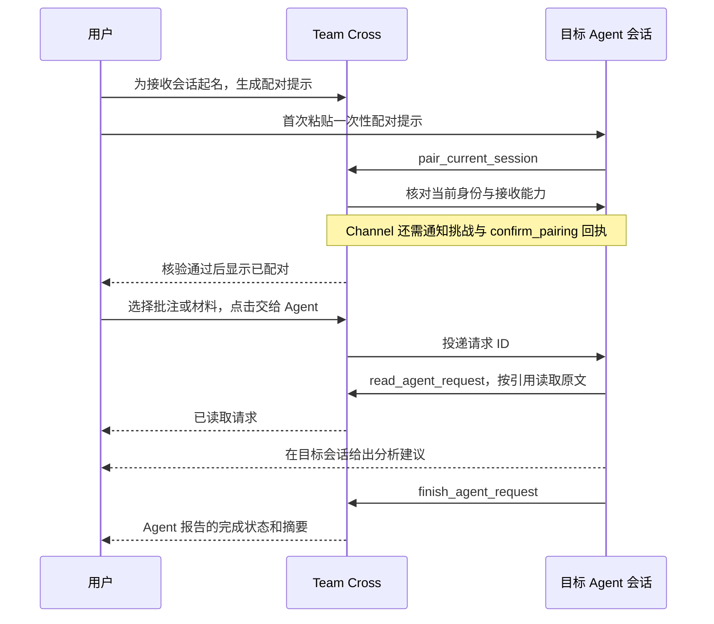

# 接收会话配对与交给 Agent

本页维护配对身份、接收适配范围、明确发送与回执的领域契约及取舍。字段和路由见 [协议](../protocol.md#接收会话配对与请求)，验证方法见 [验证门槛](../validation/test-gates.md#接收会话配对)，最近已知结果及未覆盖路径见 [证据入口](../validation/evidence-map.md#配对与空间请求)。

## 统一交互

批注、资源选择清单和设置使用同一套接收会话配对流程。用户先为目标起名，生成十分钟有效的一次性提示，粘贴到要接收任务的具体会话，由 Agent 调用 `pair_current_session`。Core 依据工具传输提供的会话身份和实际接收方式核对目标。新的会话需要单独配对，不按最近使用的会话猜测目标。

配对完成后，在批注或选择清单点击“交给 Agent”，选择已配对目标，选择“分析后告诉我”或“分析并回复原批注”，编辑处理要求后发送。选择清单里的“生成读取入口”和批注的“复制提示”继续可用。配对可在设置移除，最近二十个请求的处理回执也可在设置查看。

保存批注本身不启动 Agent；只有明确发送才创建请求。配对不启用共同执行、不创建 fork、不接管输入权、不共享其他个人历史，也不订阅后续讨论。“关注后续讨论”的事件筛选与授权属于后续工作。

## 身份、接收能力与范围

配对面向确定的原生会话，创建入口和用途不划分接收能力，见 [会话与接收能力](../product-core-and-glossary.md#会话与接收能力)。实际投递核对身份、连接、授权和运行状态；当前 Team Cross 的接入限制见下文。

空间内的公开批注与材料可以通过工作台发起空间请求。成员需将配对明确关联到空间；接收目标可分布于不同成员的 Core，记录和结果由空间托管端保存。此路径不自动公开个人配对列表或旧请求，也不要求把 A 的配对码粘贴到 B 的 Core。需要另起上下文时，可按需新建会话并绑定返回的原生 ID。详细语义见 [空间工作台](space-workbench.md)。

- Codex 身份来自 MCP `_meta` 中的当前 thread/turn；Claude 来自进程的 `CLAUDE_CODE_SESSION_ID` 和本次 `_meta.claudecode/toolUseId`。个人 Claude 的配对、接收核验和请求读取/完成都核对工具调用确实存在于该会话最新 transcript，防止恢复会话后使用过期进程身份。工具参数不能指定 Provider、Session 或接收连接。
- Codex 通过原生连接向确定的 `threadId` 提交输入；`thread/start`、`thread/fork` 和 `thread/resume` 分别建立或继续会话，后续均使用 `turn/start`。当前投递复用 `Session.RPC(turn/start)`，检查连接、输入授权、空闲状态及审批，同一请求 ID 不重复执行。投递到共同执行目标时，另遵守其输入归属和本空间引用范围。原生接口见 [App Server 文档](https://learn.chatgpt.com/docs/app-server)。
- 个人 Claude 使用独立于共享运行时的实验性 Channel 适配器。STDIO 声明 `experimental["claude/channel"]`，Core 将最小事件送到该连接，再发 `notifications/claude/channel`。首次配对必须收到通知中的随机挑战并通过 `confirm_pairing` 回传，写入 STDIO 本身不是接收证明。未开启 Channel、账户/组织不支持或宿主丢弃通知时，状态停留在 `verifying`，到期失效。
- 配对绑定用户选定的原生会话，不隐式新建会话或切换目标。创建与恢复运行时按明确操作执行，核对原生 ID，不猜测默认 app-server，也不把普通 MCP 日志通知当作模型唤醒。[工作台的新建入口](space-workbench.md#按需新建接收会话)是可选操作，不是接收请求的前提。
- 配对码、会话目标和选择引用均属于当前 Core 数据目录。跨设备配对码路由尚未接入，不能把 A 上的码直接交给只连接 B Core 的工具。已有 `joined-…` 引用仍按本机成员权限读取。

### 当前接入范围

当前 [Core 实现](../../../../internal/collab/agents.go)中，`pairAgent` 只在 `a.sessions` 查找已保存的原生运行时；`agentSession` 只从 `a.sessions` 或 `a.receivers` 取得投递连接。工作台新建会话时直接核对并保存其原生 ID 和配对。已有 Codex 会话若未命中上述配对查找，即使身份核对成功，也由 Team Cross 返回 `unsupported`。这是连接发现与接入范围的实现限制，不能据此将已有会话划为不支持接收；接入该目标应复用同一原生输入、授权、去重与回执流程。

缺少可核对身份的调用也返回 `unsupported`，应结合 `reason` 判断本次配对失败原因。对应的实际验证范围见 [证据入口](../validation/evidence-map.md#配对与空间请求)。

Claude 的普通 MCP 配置不代表已启用 Channel。开发接入需按 [官方 Channel 文档](https://code.claude.com/docs/en/channels-reference) 在运行中的客户端显式启用对应服务；Team Cross 不自动改写用户的启动参数或账户设置。该适配仍为实验性，最近已知真实探测受宿主门槛阻塞，具体版本及失败范围见 [证据入口](../validation/evidence-map.md#配对与空间请求)。协议测试通过不能推广为任意账户上的真实模型验收。

## 投递与回执

请求保存用户处理要求、处理方式和不可变引用组。材料引用绑定固定版本；批注保留原批注身份；上下文仍需重新核对当前原文。发送及 `read_agent_request` 都重新检查引用可访问性，后续正文读取继续使用 `read_material`、`read_annotations`、`read_context` 等既有工具。

通知只带请求 ID。Agent 调用 `read_agent_request` 后才记录已读取；引用每页一项，按 `nextOffset` 继续；调用 `finish_agent_request` 才记录它报告的完成/失败与摘要。完成回执不等于批注回复已保存，回复仍须由 `reply_to_annotation` 单独返回保存回执。原生 `turn/start` 返回和 Channel 传输成功均不代表分析完成。

请求状态为 `submitting → submitted → received → completed/failed`，投递结果不明使用 `unknown`。接收或完成可以早于发送调用返回，后来的发送回执不得回退状态。请求在写入外部会话前落盘；Core 重启把未确认的 `submitting` 视为 `unknown`，不重放写入。相同请求 ID、相同内容返回已有状态；内容变化拒绝。

Channel 连接租约只存在内存。STDIO 结束会取消接收请求；Core 重启或接收连接失效后需要重新配对，不自动重放未确认事件。移除配对阻止后续读取与投递，已提交的原生输入不因此撤回。宿主自身的工具权限确认保持有效。

## MCP Events 的边界

[OpenAI MCP Events 文档](https://developers.openai.com/plugins/build/mcp-events) 当前描述的是支持 MCP 2.0 的插件及 webhook 订阅，宿主范围为 ChatGPT Work Cloud 和 dots。它要求可被该宿主访问的认证 MCP endpoint、订阅管理和签名 webhook，并不是给本机 STDIO 增加通知就能向任意 ChatGPT 会话发送输入。

本实现先提供统一的配对、请求与回执模型，以及本机原生/Claude Channel 适配。**尚未实现 MCP 2.0 `server/discover`、`events/list/subscribe/unsubscribe` 和 ChatGPT webhook 投递**；未发布公网 MCP 服务，也未把本地 Core 暴露到公网。下一阶段需要确定云端接入与身份映射，在保持同一配对界面的前提下增加 MCP Events 适配器，并用真实订阅回调完成接收核验。

实现入口：[Core](../../../../internal/collab/agents.go)、[路由](../../../../internal/collab/agents_http.go)、[MCP](../../../../internal/mcp/agents.go)、[界面](../../../../packages/web/src/components/AgentPairings.tsx)。字段见[协议](../protocol.md#接收会话配对与请求)，验证方法见[验证门槛](../validation/test-gates.md#接收会话配对)。
