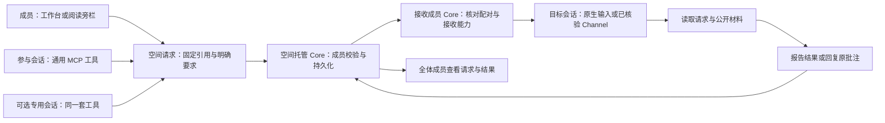
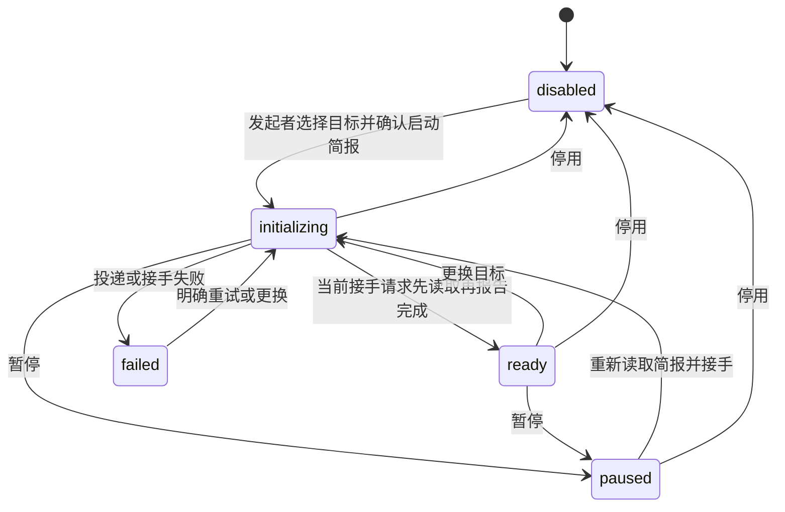

# 空间工作台、简报与可选专用会话

本页维护空间请求、简报、参与会话和专用角色的领域契约及取舍。底层接收范围见 [配对契约](agent-pairing.md)，字段和路由见 [协议](../protocol.md#空间工作台与独立接收会话)，实际执行结果与环境边界见 [证据入口](../validation/evidence-map.md#配对与空间请求)。

空间工作台让成员和参与会话围绕已发布材料发起明确请求，并在空间内共同查看进展。阅读旁栏提供就地入口，工作台提供完整的请求、简报和参与会话视图。两处复用现有材料阅读、批注、配对、发送表单和回执组件。

工作台以阅读、请求、简报和参与会话为固定入口。参与会话优先展示已关联目标与接收状态；“添加会话”集中选择关联已有配对或新建独立会话，选择方式本身不发起创建。支持宿主消息的插件另提供当前会话快捷连接；云端通知在列表之后按需展开，和本地接收分开管理。专用会话设置为次级入口，不阻挡普通空间协作。

## 对象与公开范围

空间保存明确关联的接收目标、空间请求和结果、成员确认的简报，以及零个或一个专用会话角色。它们与可选的共同执行独立。创建普通空间、关联已有配对、编辑简报，都不创建原生会话或启动模型输入。

个人配对列表仍属于当前 Core。成员必须明确连接当前会话或把已有配对关联到空间，其他成员才看到其名称、所属成员、Provider、接收状态和空间目标 ID。原生会话 ID、私人历史、接收连接与凭据不进入空间目标。各成员可在自己的 Core 关联目标；空间托管端通过成员凭据确认其所属身份。

空间请求公开处理要求、发起成员及人工/会话身份、接收目标、固定引用、关联请求、各阶段回执和结果摘要。已有个人请求不会自动公开。引用限于本空间已发布材料的固定版本及可公开批注；不接受文件、原生历史或其他私有执行上下文。批注回复与请求完成分别保存，“完成”不自动意味着已回复原批注。

## 成员和参与会话共用投递能力

通用 MCP 提供列举空间目标、读取简报、列举/读取空间请求和发送请求。任何经身份核对、具有该空间访问的参与会话都能使用，不要求先成为专用会话。个人 MCP 从当前传输核对来源，绑定运行时只访问自己的空间。工具参数不能冒充成员或指定另一个原生调用者。

接收成员 Core 只领取自己明确关联目标的请求。在外部输入前持久化一次性领取状态，随后复用配对投递。投递到共同执行会话时，仍需请求发起者具有执行访问和当前输入权，并在发送、领取和实际 RPC 前检查；关联目标和投递请求本身不授予共同执行权限。

请求状态区分排队、已提交、Agent 已读取、已报告完成/失败、结果不明和取消。排队只能取消尚未投递的请求；输入已提交后不声称撤回。丢失响应只查询同一 ID；Core 重启、断线重连、页面刷新不会重放外部输入。接收租约仅用于可用性判断，不能作为 Agent 已收到请求的证明。

“基于此请求继续协作”创建带父请求 ID 的新请求。MCP 会话同样可在明确授权下使用该关联。收到请求不自动授权广播、循环追问或订阅；持续关注使用独立的 [空间事件授权](space-events.md)。

## 空间简报

普通请求创建时保存不可变的完整简报快照与版本、该目标上次实际读取的简报版本，以及父请求当时的状态、要求和摘要。相同请求 ID 不因简报更新而刷新上下文；列表只带版本，按请求 ID 读取完整快照。投递前检查完整封装大小，过大时拒绝创建，避免目标接收后无法读取。

简报包括当前议题、已确认决定、待解决事项，以及条目对应的固定材料/批注来源。成员保存时确认内容；会话可通过结果或讨论提出建议，但不能把建议自动写成团队决定。阅读来源旁显示本页相关请求进展；有结果的请求可将摘要加入“待解决事项”或“决定草稿”，保留来源与请求 ID。该动作只准备草稿，仍需成员编辑并明确保存。

每次保存带读取时的版本；发生并发更新时拒绝覆盖，界面保留草稿并提示先读取新版本再合并。所有参与会话都可读取当前简报。阅读历史、模型上下文和空间简报是不同对象，修改简报不自动向会话发送输入。

界面分开展示决定和待解决事项；编辑时标明未保存草稿，固定来源通过可搜索的勾选列表选择。同一空间内切换工作台页签保留草稿和所选来源，只有明确保存才更新确认版本；页面刷新不承诺恢复草稿。请求卡片保留结果、来源与接手上下文入口，把继续协作和整理到简报区分为两组操作。

## 每空间最多一个可选专用会话

专用会话是空间发起者赋予某个明确接收目标的角色。空间创建时默认关闭，成员照常协作；只有需要持续整理议题、核对材料或协助分派时才显式启用。角色不能绑定当前共同执行会话，避免把空间协调入口与项目输入归属混在一起。

启用、恢复介入或更换时，保存不可变启动快照，并通过普通请求投递。快照包括空间身份/名称、此次角色版本、确认简报及版本、公开材料目录、关联目标、待处理请求 ID 和介入规则。启动目录有上限并返回总数，需要时通过通用工具读取完整目录及固定版本正文，不塞入私人历史或全部材料。

启动规则要求先核对简报、说明理解的议题和缺失信息，未知保持未知；只响应用户明确请求，不接管其他会话，不把自身建议当成已确认决定。只有当前接手请求确实读取并成功报告结果，角色才显示“已接手”。界面展示快照预览、待确认、失败、暂停和回执入口。

唯一角色使用版本比较保护并发启用与更换。暂停阻止该角色接收和发起新的空间请求，取消尚未投递给它的请求；已提交输入和晚到结果保留原归属。恢复介入会重新读取当前简报。停用释放角色，该目标仍是普通关联会话；更换后旧目标也保留，旧接手结果不能覆盖新角色。上述操作均不删除原生会话或目录。

## 按需新建接收会话

成员希望为当前空间另起上下文和工作目录时，可使用“创建独立接收会话”入口。本机 Core 使用原生 `thread/start`，建立专用工作目录并确认返回的原生 ID，然后把该会话配对并关联到当前空间。创建本身不发业务 prompt；随后成员可向它发送请求，或由空间发起者将其指定为专用会话。新建是可选操作，已有 Codex 会话使用同一原生输入机制；当前连接接入限制见 [配对契约](agent-pairing.md#当前接入范围)。

该入口不 fork 来源，不检出 Git，不建立空间的 `execution`，不向其他成员开放原生控制。运行在创建者的 Mac，模型继承本机原生配置，启动采用受限模式；所需审批由该成员在本机面板或原生 TUI 处理。界面提供原生 TUI 命令和运行时确认的模型；不固定产品模型或推理强度。

接收会话使用只绑定当前空间的 MCP 凭据和精确原生调用身份。它能读取公开材料/讨论、使用通用空间请求工具；不能通过该 MCP 枚举私人来源或读取其他空间。Core 重启后保留同一原生 ID、记录与目录，不自动恢复进程或投递；成员显式恢复接收后继续使用原会话。恢复时重建空命令记录表，首次写入仍先持久化命令再投递；异常清理释放会话锁，不阻塞后续状态检查。成员离开或访问被撤销后，后续空间工具调用拒绝。

原生恢复仍依赖 Codex 已落盘的历史：在本次 `0.160.0` 验证中，仅完成 `thread/start`、尚未产生首个回合的空会话在重启后返回 `no rollout found`。此时保留原记录并报告恢复失败，不隐式创建替代会话；历史创建失败记录的明确重试验收不覆盖这一路径。

设置页、接收会话创建/恢复和助手卡片共用当前 Codex CLI 发现逻辑。卡片每次刷新重新读取有效路径，不把持久化的创建失败当作当前检测结果。客户端恢复后，尚未发送原生创建请求的失败记录可明确重试，复用原接收记录、目录与 requestId；读取状态不启动会话。新创建在缺少 CLI 时直接返回错误，不新增失败卡片。创建阶段在发送 `thread/start` 前持久化，已发送但结果不明的请求不能重建；旧版精确的“Codex 路径不可用”且无原生 ID 的记录属于客户端启动前失败，可走同一重试入口。

## 首版边界与重新评估条件

- 空间仍由单一主机保存。成员离线、会话忙碌、权限待确认或接收租约失效会影响投递，状态与原因必须可见。
- 专用会话不成为新的共同执行入口；项目执行继续遵循既有执行授权、输入权及原生审批。
- Claude Channel 沿用实验性配对契约。跨设备配对码路由尚未接入；ChatGPT 云端事件已实现协议和隔离网关，真实宿主验收暂缓，详见 [空间事件](space-events.md)。当前连接范围由 [配对契约](agent-pairing.md#当前接入范围)维护。
- 空间关联、请求处理与持续订阅分别授权。事件接收不授予自动分派或共同执行；模型后续行动遵守用户选定范围。工作流重试不能由 webhook 的传输重试推导。

实现：[空间业务](../../../../internal/collab/workbench.go)、[成员 Core 桥接](../../../../internal/collab/workbench_bridge.go)、[独立接收会话](../../../../internal/collab/space_receivers.go)、[MCP](../../../../internal/mcp/workbench.go)、[工作台](../../../../packages/web/src/components/SpaceWorkbench.tsx)。字段和路由统一维护在 [协议](../protocol.md#空间工作台与独立接收会话)，可重复验证入口见 [验证门槛](../validation/test-gates.md#空间工作台)。
