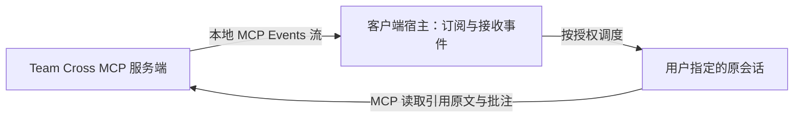
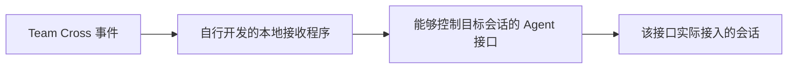
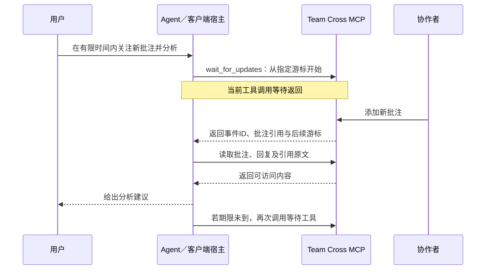

# 本地 MCP Events 流与等待型 MCP 工具：方案备忘

记录日期：2026-10-05（Asia/Shanghai）。状态：讨论备忘，两个方案均未因本次记录而实施或进行真实宿主验收。本次授权仅为记录方案；后续是否实施、选择哪个目标宿主及验证范围尚未确定。

这是对[接收会话推送方案概览](2026-10-05-receiver-lifecycle.md#方案比较与证据层次)中两个候选方案的详细补充，不重复维护当前产品支持范围或验收状态。当前能力仍以[配对契约](../sources/decisions/agent-pairing.md)、[空间事件契约](../sources/decisions/space-events.md)与[证据入口](../sources/validation/evidence-map.md)为准。

## 两个方案解决的场景

| 方案 | 谁发起接收 | Agent 为什么开始或继续处理 | 主要边界 |
| --- | --- | --- | --- |
| 本地 MCP Events 流 | 宿主建立 `events/stream` 订阅 | 宿主接收事件后，按用户授权调度准确目标会话 | 服务端、宿主接收与会话调度都必须接通；协议草案存在不代表客户端已经实现 |
| 等待型 MCP 工具 | 正在执行任务的 Agent 调用 `wait_for_updates` | 工具返回结果后，宿主继续当前轮次 | 依赖已有轮次及等待调用；任务结束后不能自行启动会话 |

两者都应基于用户明确指定的空间、关注范围与处理要求。连接身份、持续关注授权、事件送达、原文读取、分析完成和回复保存分别判断；仅收到事件不授予回复批注或共同执行权限。

## 方案一：本地 MCP Events 流与宿主适配

MCP Events [设计草案](https://github.com/modelcontextprotocol/experimental-ext-triggers-events/blob/main/docs/design-sketch-proposal.md#push-based-delivery)描述了 `events/stream`：客户端发起长期请求，STDIO 通过 stdout 事件通知返回，Streamable HTTP 通过 SSE 返回。草案状态及目标宿主实现需在实施前重新核对。

标准接入的数据流：



Team Cross 能实现服务端的事件目录、筛选、事件流及引用读取。客户端宿主还需要建立订阅、接收并路由事件，以及启动目标会话处理。仅向 STDIO 或 SSE 写入通知，或仅取得会话 ID，都不能证明原会话开始处理。

若目标宿主缺少这层能力，自行补足会形成独立的宿主适配：



独立接收程序仍需可调用的目标会话入口。调用 `turn/start` 属于客户端专用投递适配；自行运行 Agent SDK 则需要维护 Agent 与会话。两者均不能自动证明用户原先打开的个人会话已经接通。没有会话控制入口时，接收程序只能收事件。

讨论中的建议是等待或核对目标宿主的事件入口，不为本次需求另造本地宿主。自行增加适配属于范围扩展，不能作为 MCP Events 的前置工作或原需求已交付的依据。协议具备本地传输设计，也不构成任何产品的本地支持时间表。

后续选定本方案时，先确认宿主能力，再验证准确原会话的订阅、事件到达、处理启动、原文读取及处理回执；另覆盖取消、权限撤销、断线恢复和重复事件。验证必须区分协议模拟与真实目标宿主。

## 方案二：等待型 MCP 工具

这是普通 MCP 工具调用的有时限等待模式。Agent 已在执行一轮用户任务，调用候选工具 `wait_for_updates`；Team Cross 保留待返回调用，更新出现后返回引用，宿主按正常工具执行流程继续当前轮次。`wait_for_updates` 及下列参数只是设计示例，不是已注册工具或正式协议契约。

示例用户要求：“接下来 20 分钟关注这个空间的新批注，收到后读取引用原文，分析意见是否成立，先把建议告诉我。”总关注期限与每次工具等待期限分别管理。

```json
{
  "spaceId": "space_123",
  "afterCursor": "cursor_42",
  "maxWaitMs": 20000
}
```

空间 ID 与游标为虚构示例；20 秒只是单次等待示意，实际时长必须根据目标宿主的工具超时确定。



候选行为：

- 已有游标后的更新时立即返回；没有更新时异步等待，有变化便返回，无需等满期限。
- 达到单次等待期限仍无变化时返回空结果；Agent 根据用户总期限决定是否继续，不默认无限循环。
- 用户取消或连接中断时释放等待资源；权限撤销时停止访问，不用缓存原文兜底。
- Agent 分析期间出现的变化保留为可再次读取的事件；下一次调用从游标继续，避免漏读或重读全部历史。事件保留时长、容量与游标失效行为待设计。
- 返回位置只代表本次取得哪些事件，不等于分析完成；处理回执与回复保存仍分别确认。

| 会话状态 | 新变化发生后的行为 |
| --- | --- |
| 有待返回的等待调用 | 工具返回更新引用，当前轮次继续处理 |
| 正在分析上一条更新 | 变化保留，下一次调用再读取 |
| 任务已结束且没有等待调用 | 变化可保留，但本方案不会自行启动会话 |
| 已取消或连接中断 | 本次等待结束，后续需重新发起关注 |

服务端等待可以挂起 I/O，不要求模型持续生成文字；每次返回后的判断、分析和再次调用仍增加运行及上下文开销。服务端参数不能覆盖宿主超时。[MCP TypeScript SDK 请求选项](https://ts.sdk.modelcontextprotocol.io/v2/api/index/@modelcontextprotocol/client/#requestoptions)提供请求超时、总时长上限与按进度重置超时等客户端选项；是否启用由客户端决定，进度通知不能保证无限等待。[取消处理](https://ts.sdk.modelcontextprotocol.io/v2/servers/logging-progress-cancellation)也需要服务端响应并释放资源。

此方案不要求 Team Cross 控制原生输入接口，适合“我们现在一起评审，短时间内有新批注就继续分析”。长期后台关注或任务结束后自动恢复，需要宿主事件订阅或调度能力，不能只靠普通工具等待完成。

后续选定本方案时，先用专用会话验证工具调用能否等待并让同一轮次继续，再核对实际超时、取消、用户新输入的处理方式、权限撤销、分析期间积累事件的读取与重复处理。真实模型验证沿用仓库要求，只使用 `gpt-5.6-luna`；本次没有启动该验证。

## 本次记录范围

本次只保存两种候选方案和后续验证点，没有修改实现、配置、领域契约或验收结论。后续实施前应重新核对具体宿主版本、实际接入入口和当前工作树；形成新的支持范围或验收结果后，再同步领域契约与证据入口。
