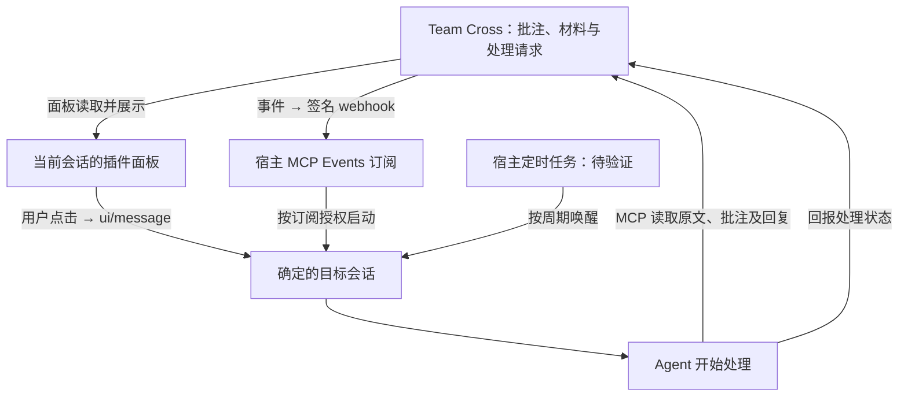

# 接收会话推送方案与待验证问题

更新日期：2026-10-05（Asia/Shanghai）。核对工作树：`codex/collaboration-flow`，HEAD `ae66ff6` 加当前未提交改动。本次仅整理同日的代码、执行记录与官方文档评估，没有实现候选方案、创建定时任务或新增宿主验收；平台范围应在后续实施前重新确认。

调查工作树中已完成、尚未合入 Meta 的审批残留修复、准确轮次停止、深链接验证，以及 TUI / 专用 Desktop 交接澄清，已移至[原生生命周期回归与接入澄清](finished_archived/2026-10-05-receiver-lifecycle-validation.md)。完整检查结果、结构化摘要、复现入口与当时未覆盖项均保留在该报告，不在活跃任务重复展开。

## 个人 Desktop 的当前缺口

现场的个人 Desktop 使用独立 STDIO app-server；当前 `ConnectExisting` 只连接提供控制 socket 的 daemon，并要求其加载准确目标 thread。此次没有接通现场运行实例，拿到 MCP thread 身份或打开深链接均不能补足接收入口。该结果不表示 Desktop 原理上无法接收外部输入。

TUI 与 Team Cross 专用 Desktop 已有共同接入协作网关的机制，不需要重新设计；该机制也不能证明日常个人 Desktop 的原会话已接通。详细连接图与代码依据见[归档澄清](finished_archived/2026-10-05-receiver-lifecycle-validation.md#追加澄清现有交接与个人-desktop-推送)。上述生命周期修复仍属于未提交工作树，尚未合入 Meta 或安装；它与已通过独立分支提交的接收恢复死锁修复不同。个人 Desktop 推送、侧边栏自动刷新、`agents` 的 `x` 快捷键和两台 Mac 行为仍未纳入通过结论。

## 已确认目标与本次判断

用户希望通过一次统一的首次连接，减少把 `read_selection` 或批注读取提示复制到 Agent 的步骤，并让获授权的会话持续接收新批注等变化。连接入口不按共享或个人会话另设产品流程；身份关联、实际接收能力和持续关注授权仍需分别核对。

用户已明确指出：Codex `turn/start` 与 Claude Channel 不是 MCP Events 的前置工作；不能在 Events 尚未接通时，扩展这些替代通道并当作原需求交付。本次比较说明各方案的适用目标，不将新增通道、改变个人 Desktop 启动方式或新建会话视为已确定的实施方案。

完整接收包含两个环节：事件到达客户端，以及宿主让准确目标会话开始处理。WebSocket、SSE、HTTP 或 STDIO 解决传输问题；目标会话的调度仍需要宿主接口与授权。拿到 thread ID、完成配对或收到传输回执，都不能单独证明模型已经开始分析。

当前实现不能概括为所有场景的最佳方案。本次建议是：单次手动交办优先复用插件消息桥；持续自动关注优先完成 MCP Events；个人本地会话缺少事件接收入口时，将宿主定时唤醒后读取更新列为待验证备选。上述建议不改变现有产品支持范围。

## 方案比较与证据层次

| 接收方式 | 适用交互与平台能力 | Team Cross 当前接入及证据 | 本次判断 |
| --- | --- | --- | --- |
| MCP Events webhook | 首次订阅后由宿主接收事件并处理；ChatGPT 当前接入网页 Work、桌面 Work 的 Cloud 模式及 dots | 已有发现、订阅、签名投递、持久化和隔离网关；本地协议与回环网关有执行记录，真实 Cloud 宿主验收暂缓 | 持续关注的优先路线；协议通过不能替代目标会话处理通过 |
| 插件 `ui/message` | 在当前会话的面板中明确点击，向宿主当前对话发送消息；需要宿主声明消息能力 | `sendSelection` 已发送固定读取编号，“带回当前对话”已有实现；对应浏览器记录中的宿主消息回执为模拟，不据此扩大真实宿主验收范围 | 单次免复制操作的直接路线；不负责向另一配对会话投递，也不承诺关闭面板后的后台接收 |
| 宿主定时唤醒并读取更新 | 宿主按周期恢复原会话，Agent 再通过 MCP 读取变化；官方提供同一会话的定时任务能力 | 本次未建立或验证 Team Cross 的增量读取与定时处理闭环 | 接受检查延迟时值得验证；需检查空轮次开销、游标、离线恢复与重复处理 |
| 等待型 MCP 工具 | Agent 在当前轮次调用等待工具，有变化时工具返回后继续处理 | `wait_for_updates` 仅为候选工具示例，当前没有这项实现或验收 | 适合短时间共同工作；受轮次存活、工具超时与取消影响，不优先作为长期后台方案 |
| 客户端专用接口 | Codex app-server 可开始目标 thread 的轮次；Claude Channel 可向启用它的 Claude Code 推送通知 | 原生 daemon 路径有单 Mac、专用会话结果；日常个人 Desktop 的现场运行时未接通；Claude Channel 最近真实探测受宿主门槛阻塞 | 是否维护由明确的客户端支持目标决定；不能替代 MCP Events 交付，也不能把原生能力当作所有客户端已接通 |
| 本地 MCP Events 流 | MCP 草案描述 `events/stream`，经 STDIO 通知或 HTTP SSE 传递事件；宿主还需实现订阅及处理调度 | 当前 Events 目录只声明 `webhook`，本地 Events 流未接入；所核对的 ChatGPT Events 集成不支持 streaming / polling | 是本地标准化接入的候选方向；草案存在不代表目标宿主已实现，没有据此确认本地支持时间表 |

定时任务读取普通 MCP 工具，与 MCP Events 草案的 `events/poll` 是不同接入方式。建议前者不表示当前 ChatGPT Events 已支持后者。本地执行还需核对机器、应用及数据源在线条件；定时任务应只在有新内容时处理，并保存读取位置，不能以反复读取全部历史作为默认设计。

平台依据：[OpenAI MCP Events](https://developers.openai.com/plugins/build/mcp-events)、[MCP Apps UI 消息桥](https://developers.openai.com/plugins/build/chatgpt-ui)、[宿主定时任务](https://learn.chatgpt.com/docs/automations)、[Codex App Server](https://learn.chatgpt.com/docs/app-server)、[Claude Channel](https://code.claude.com/docs/en/channels-reference)、[MCP Events 草案](https://github.com/modelcontextprotocol/experimental-ext-triggers-events/blob/main/docs/design-sketch-proposal.md)。Cloud 范围来自当前 ChatGPT 集成，不是协议要求事件只能在云端发生；官方文档没有说明先支持 Cloud 的产品原因，本记录不推定其原因或未来发布时间。

## 交互与数据流

下图比较三种启动处理的路径。插件消息已有实现，Events 尚缺真实 Cloud 验收，定时读取是待验证方案；图示不代表三条路径均已可用。

三条路径均需在读取时核对访问权限、固定引用与当前原文。建议先在目标会话告诉用户；只有用户已授权回复时才调用原批注回复工具。事件接收、原文读取、分析完成和回复保存分别记状态，避免将 `ui/message` 或 HTTP 2xx 当作分析完成。

统一连接流程可以沿用，但后续界面需基于核验结果说明“即时自动接收”“定时检查”或“手动发送”等实际能力。这里的能力展示是建议，不能在尚未接入时显示为可用；用户无需选择底层 RPC、Channel 或传输协议。

## 当前 Events 与原需求的差距

1. **明确交办尚未使用 Events。** [事件目录](../../../internal/mcpevents/rpc.go) 只有 `space.brief.updated`、`space.discussion.updated` 和 `space.request.completed`；[明确发送](../../../internal/collab/agents.go) 仍分派到原生、Codex 代理或 Claude Channel。若要用 Events 实现“交给 Agent”，需设计明确请求的事件、订阅目标、用户处理要求和按权限读取引用的闭环；事件名称尚未确定。本次没有新增该事件。
2. **当前观察语义会合并连续变化。** [空间事件采集](../../../internal/collab/space_events.go) 每三秒观察快照，适用于“讨论有更新”的通知，不保证逐次修改的完整事件历史。对于每一次明确交办，建议在保存请求时同步保存独立待投递事件，保留请求 ID；现有[持久化投递与重试](../../../internal/mcpevents/manager.go)可复用。不能把该建议写成已经实现，也不应自动重放结果不明的原生写入。
3. **宿主端闭环仍未取证。** [2026-10-04 执行记录](finished_archived/2026-10-04-collaboration-flow/README.md#事件与界面)覆盖受控回调与真实本地网关，未联系真实 ChatGPT Cloud。此前暂缓 Cloud 验收的边界继续保留，本次记录请求不包含公网部署或恢复验收的指令。

当前能力的维护位置仍是[配对契约](../sources/decisions/agent-pairing.md)、[空间事件契约](../sources/decisions/space-events.md)、[本机插件消息入口](../sources/decisions/chatgpt-local-plugin.md#带给当前个人-agent)与[证据入口](../sources/validation/evidence-map.md#配对与空间请求)。本任务保存比较与待验证建议，不新增通过结论，也不替代这些来源。

## 接续时需要确认的验证目标

以下是选择对应方案后才执行的验证清单，不表示已授权并行实施所有路线：

- **当前会话单次交办：** 在真实宿主中完成一次面板点击、准确消息投递、`read_selection` 原文读取和分析结果；单独覆盖回执丢失时不自动重发。独立浏览器窗口不能借用插件桥宣称已经向另一个会话送达。
- **MCP Events 持续关注：** 在真实目标宿主验证发现、订阅、回调核验、匹配事件接收、原文读取与处理回执，再覆盖不匹配过滤、同 ID 重试去重、取消与权限撤销。若范围包含明确交办，另验证每个请求独立到达准确订阅目标。
- **个人本地定时读取：** 先验证宿主能恢复原会话并读取 Team Cross 的目标空间，再决定是否增加增量接口；检查周期、机器休眠与重连、游标持久化、空检查开销及重复结果。不得将定时读取标为实时推送。
- **已有个人 Desktop 原会话即时接收：** 参照归档报告的接入澄清与验证边界，核对实际运行时入口、同一轮次与审批、当前模型和权限。专用 Desktop / TUI 已有交接机制可复用的部分，与日常个人 Desktop 的缺口分开处理；不以另开同 ID 运行实例冒充原实例接通。

后续若实现或验收改变支持范围，应同步更新领域契约与证据入口。本次只整理评估并归档已完成记录；原有通过、阻塞及未覆盖状态仍限定于各自的版本和环境。
