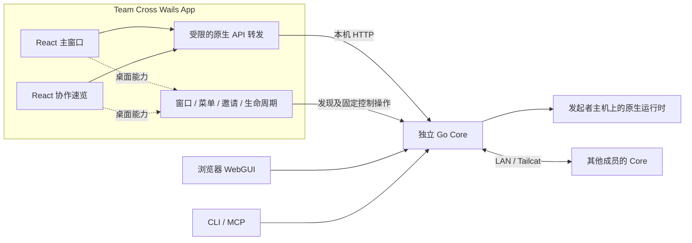

# Next：WebGUI 迁移到 Wails 桌面端

状态：用户已确认 Wails v3 + React + 独立 Go Core，并授权按关键功能通过 PR 合入 `Next`，较大功能拆成多个 PR。P0 请求通道、P1 主窗口、P2 单实例/原生邀请传输及 P3 显式退出、速览与原生菜单、可见性调度已分别合入。邀请事件已在 PR #35 补齐本机人工验收并合入（`4e9d024`）；共享主题、启动/退出配合、原生命令行入口与显式服务恢复均已合入；当前推进安装候选与旧版升级验收。稳定边界已进入 [桌面契约](../sources/decisions/desktop-host.md)。

调查日期：2026-09-30。Team Cross 基线为 `9abee024a415c1ee115224cf1d5776b2cdce165a`；本地 `Next` 直接从该提交创建。OpenSurge 参考为本次更新并读取的 `origin/Next`：`d968c88bf0558df2517c623d694d5a802c1beb6c`。没有切换或修改 OpenSurge 的工作区。

## 建议方向

采用 **Wails v3 原生外壳 + 现有 React 前端 + 独立 Go Core**。主窗口、菜单栏速览和原生桌面能力由同一个外壳管理；空间、材料、讨论、输入协调、Provider 会话和 LAN/Tailcat 连接继续由 Core 管理。

主窗口优先内嵌现有前端构建，通过原生 HTTP 转发访问本机 Core。这样 Core 重启或端口变化时，可以重新连接数据而不重新加载 React 页面。浏览器入口继续复用同一份前端与 Core API，CLI 和 MCP 保留独立使用方式。

首轮候选锁定 OpenSurge 使用的 `github.com/wailsapp/wails/v3 v3.0.0-beta.26`，在隔离预览中验证后再决定版本。Wails 官方当前把 v3 标为 beta、v2 标为稳定版；这是采用 v3 时需要承担的依赖风险，不能将 OpenSurge 的通过记录当作 Team Cross 的验收。[官方版本说明](https://v3.wails.io/faq/)

Wails 与现有 Go、React 技术栈匹配，且具备菜单栏、窗口和桌面事件入口。Wails v2 可作为 v3 原生行为出现阻塞后的备选；另引入 Rust 外壳或完整浏览器运行时目前缺乏足够收益。本轮不承诺性能提升，后续应实测冷启动、空闲 CPU、内存与隐藏窗口行为。

建议继续以 Apple Silicon、macOS 14+ 为交付范围。Team Cross 桌面 App 与“Codex 专用 Desktop”是两个产品入口：前者管理和阅读协作，后者直接操作共享 Codex 会话；此次迁移不将原生 Agent 终端、模型选择或审批界面重做进 Team Cross。

## 已核对的基础与差异

| 当前事实 | 对迁移的影响 | 依据 |
| --- | --- | --- |
| 前端为 React 19、TypeScript、Vite，业务组件和 API 已集中在 `packages/web` | 复用页面与阅读实现，不另建桌面业务 UI | [package.json](../../../packages/web/package.json)、[App.tsx](../../../packages/web/src/App.tsx) |
| 路由使用 hash，普通请求使用相对 `/api/`；界面刷新主要使用轮询 | 可保持路由和 HTTP 契约；首阶段无需为了 Wails 引入 SSE 或 WebSocket | [api.ts](../../../packages/web/src/api.ts)、[App.tsx](../../../packages/web/src/App.tsx) |
| 菜单栏速览已经是 WKWebView 加载 `/#/library/quick`，并有固定浮窗和全局热键 | 复用 `QuickLook`，重点迁移容器和窄桥接 | [TeamCross.swift](../../../apps/macos/TeamCross.swift)、[QuickLook.tsx](../../../packages/web/src/components/QuickLook.tsx) |
| CLI、MCP、App 通过同一启动器和发现文件复用后台 Core | Wails 不应再实例化 `collab.App`，也不应把 Core 生命周期绑到窗口 | [service.go](../../../internal/service/service.go)、[main.go](../../../cmd/teamcross/main.go) |
| 普通页面 API 验证 loopback Host 和请求 Origin；控制 API 额外要求本机 token 且拒绝 Origin | 不能把 `wails://localhost` 直接跨源请求到 Core，也不能泛化转发本机控制凭据 | [http.go](../../../internal/collab/http.go)、[main.go](../../../cmd/teamcross/main.go)、[onboarding.go](../../../internal/collab/onboarding.go) |
| App 有独立 `app.lock`、按用户与规范化数据目录区分的 IPC、请求去重及入队确认 | Wails 的默认单实例选项不能自动替代现有语义 | [AppInstance.swift](../../../apps/macos/AppInstance.swift) |
| 语言已由 Core 持久化；主题和部分客户端偏好仍在 Web Storage | 桌面窗口间可统一偏好，但不能声称浏览器与 WKWebView 自动共享存储 | [ui_language.go](../../../internal/collab/ui_language.go)、[App.tsx](../../../packages/web/src/App.tsx)、[Clients.tsx](../../../packages/web/src/components/Clients.tsx) |
| 当前 App 显式退出会停止本机服务，活动协作先确认 | 必须保留或明确调整该契约，不能照搬 OpenSurge 的 UI-only `Cmd-Q` | [分发与首次体验](../sources/distribution-and-onboarding.md#启动发现与退出) |
| 当前 CI 只匹配 `main`；发布流程检查 `origin/main` 来源 | 建立 `Next` 工程 CI，但发布策略需要单独设计 | [ci.yml](../../../.github/workflows/ci.yml)、[分发与首次体验](../sources/distribution-and-onboarding.md) |

OpenSurge 的参考版本已经从早期“WebView 加载 loopback 页面”演进为“内嵌资源 + 原生转发”：桌面 Go module 独立，主界面和菜单栏共用 React，后台 Control Service 独立。它还包含针对 WKWebView 的外链、确认框、可见性、Dock/reopen 处理。这些是可借鉴的边界；其网关 Helper、launchd、登录项、卸载与 PKG 流程不适用于直接移植到 Team Cross。

固定参考：[桌面入口](https://github.com/YTwsy/OpenSurge-for-Mac/blob/d968c88bf0558df2517c623d694d5a802c1beb6c/apps/desktop/main.go)、[资源服务](https://github.com/YTwsy/OpenSurge-for-Mac/blob/d968c88bf0558df2517c623d694d5a802c1beb6c/apps/desktop/internal/desktopserver/server.go)、[原生转发](https://github.com/YTwsy/OpenSurge-for-Mac/blob/d968c88bf0558df2517c623d694d5a802c1beb6c/apps/desktop/internal/controlclient/proxy.go)、[桌面契约](https://github.com/YTwsy/OpenSurge-for-Mac/blob/d968c88bf0558df2517c623d694d5a802c1beb6c/docs/agent-wiki/wiki/concepts/desktop-host.md)。

## 目标结构



建议新增独立 `apps/desktop` Go module，继续使用项目要求的 Go 1.27.1+，将 Wails/CGO 依赖留在桌面构建中。根 module 不依赖 Wails；根目录 Go 测试继续覆盖 Core，桌面 module 的测试和 macOS 构建单独运行。

拟议目录，以下新路径尚未创建：

```text
apps/desktop/
  go.mod / go.sum              精确锁定 Wails
  main.go                     窗口与应用事件装配
  internal/desktopserver/     静态资源、请求校验与转发分派
  internal/coreclient/        发现、身份核验、API 转发和重连
  internal/host/              单实例、邀请队列、退出状态机
  internal/native/            必要的 macOS 原生适配
  Resources/                  Preview 和正式 App 的元数据
packages/web/src/platform/   browser / desktop 能力适配
scripts/build-desktop-app.*  隔离 Preview 构建
```

桌面 module 可通过本地 module 引用复用 `internal/webassets` 和不包含业务运行时的 `internal/service`、`buildinfo` 等基础包。不要导入 `internal/collab`、Provider 进程管理或另建协作数据库。复用 `service.Ensure` 时必须显式传入 App 内 `Contents/Resources/teamcross` 的绝对路径：该函数的默认值是当前可执行文件，直接在 Wails 里使用会错误地尝试以 GUI 二进制启动 Core。

App 仍携带既有 CLI helper，发现、启动、停止继续遵守 `start.lock`、`core.lock`、实例身份和协议检查。原生控制能力从固定方法进入，不向页面暴露任意命令、任意 URL 或通用带凭据 HTTP 客户端。

## 页面与 Core 的连接方式

| 方式 | 优点 | 代价与判断 |
| --- | --- | --- |
| WebView 直接加载 Core 的 loopback URL | 初步接入改动小，沿用当前页面同源行为 | Core 端口改变后需要换源；页面、存储、草稿和原生桥依赖服务地址。可用作技术探针，不作为推荐终态 |
| 内嵌前端 + 原生 HTTP 转发 | 资源来源稳定；服务离线时仍可显示桌面 UI；API 和组件复用 | 需要受限转发、桌面能力适配和版本检查；推荐从首个正式预览增量采用 |
| 将业务 API 全改为 Wails bindings | 可生成 Go/TypeScript 绑定 | 浏览器、CLI/MCP 与桌面将形成多套业务入口，且容易绕开 Core 的统一协调；当前没有必要 |

推荐方式下仍只有 Core 的现有 TCP listener；Wails 通过自身进程内资源传输加载页面，外壳不额外开放 HTTP 端口。

### 转发边界

1. 主窗口和速览只加载 App 内置资源。保留 `/api/...` 相对请求，由原生 handler 转发至已验证 Core；外部 HTTP(S) 链接交给系统浏览器，弹窗、新窗口和重定向也要走相同规则。
2. 原生端规范化数据目录，核对发现文件的 loopback 地址、显式端口、实例、PID、控制协议及版本。拒绝远程地址、用户信息、重定向和代理环境造成的绕行；连接固定到核验的本机目标，不能由前端提交 upstream URL。
3. 将 UI 可用的 API 路径和方法列为明确集合；排除 `/api/control/*`、`invitations/pending`、`mcp/observed` 以及运行时专用工具入口。原生状态、退出、邀请暂存分别走固定 host 方法。普通 API 不附加控制 token；不能把任意 `/api/*` 请求升级为本机控制请求。
4. 在原生资源入口核对来源和窗口权限，必要时使用每进程随机、仅用于桌面资源传输的请求能力值。该值可供受信页面使用，但不等同于 Core token，也不能成为跨进程控制凭据。校验必须在剥离页面 Origin、构造上游请求之前完成。
5. `connection.json` 的 token 留在原生内存，不传给 React、Web Storage、日志或 URL。Team Cross 当前没有 OpenSurge 的 bootstrap/session-cookie 协议，不为迁移外壳机械增加这一套。现有浏览器 API 的鉴权边界保持独立，桌面转发也不代表浏览器端新增了登录保护。
6. 控制端发现变化后重新核验身份和兼容性。首轮 Preview 限定同次构建的 host/helper/Core；后续要允许跨版本复用，应明确 UI API 能力或版本契约，不能只因 `control/status` 成功就假定内嵌前端兼容。遇到不兼容 Core 不强制停止活动协作。
7. 重连只重试明确允许的读取；不重放发布、创建、加入、回复、输入交接等 POST，即使请求看似无 body 或带有 request ID。保留现有“结果未知，先查看状态”的反馈。对响应尺寸、超时、错误脱敏和取消传播做有界处理。

这套约束主要防止新增桌面通道扩大权限；材料中的 Markdown、代码和链接仍是非可信内容，不因位于 App 窗口内就获得原生能力。

### 需要集中改动的前端位置

- 将 API 请求适配集中在 [api.ts](../../../packages/web/src/api.ts)，并覆盖 [main.tsx](../../../packages/web/src/main.tsx) 中首次读取语言的直接 `fetch`。只改 `api.ts` 会漏掉启动请求。
- 用窄的 `platform` 接口承接打开主窗口路由、固定速览、服务菜单、剪贴板和窗口可见性；替换 [library.tsx](../../../packages/web/src/library.tsx) 与 [QuickLook.tsx](../../../packages/web/src/components/QuickLook.tsx) 对 `window.webkit.messageHandlers.teamcross` 的直接判断。浏览器实现继续使用普通路由和 Web 能力。
- 保留现有材料阅读、UTF-16 原文定位、草稿和选区行为。先处理标题栏占位、窗口最小尺寸、键盘、中文输入法与外链，不同时重做页面信息架构。
- Core 失联时保留 React 树、当前路由和未提交草稿；提供连接状态与显式重试。新服务确认后刷新数据，不能通过整页 reload 恢复。邀请 pending ID 随旧 Core 丢失时显示过期，让用户重新打开邀请。
- 为 `useResource`、语言和资源库轮询增加可见性控制。隐藏/最小化窗口暂停昂贵读取，重新展示时刷新；菜单栏仅保留轻量状态。视图隐藏不暂停 Core 的在线心跳和成员连接。
- 语言继续以 Core 为准；主题建议也移到本机偏好服务，让主窗口、速览和浏览器一致。浏览器已有 localStorage 不可由 App 自动读取；首轮明确按默认值或用户在新窗口中的选择初始化，不隐式复制。读取位置、草稿和 Web Storage 必须按数据目录/窗口用途隔离，防止 Preview 与正式 App 串用。

## 桌面交互与生命周期

第一轮主界面沿用“协作空间 / 资源库 / 设置与连接”。App 打开时展示主窗口；菜单栏左键与 `Control + Option + T` 继续打开“当前协作 / 资源速览”，速览点击条目定位主窗口，支持固定浮窗。后续是否增加独立设置窗口、多个材料窗口，可在主窗口与速览稳定后另行设计。

| 动作 | 建议行为 |
| --- | --- |
| 打开 App / 已有实例再次打开 | 确保或复用 Core，激活现有主窗口；不创建重复菜单栏图标 |
| 关闭主窗口 | 隐藏窗口，保留页面状态、菜单栏与 Core；不结束协作 |
| Dock / Finder reopen | 恢复主窗口并保留草稿；不得顺带显示已关闭的其他窗口 |
| 菜单栏开关速览 | 只改变速览可见性；固定模式保留筛选和选择 |
| App 崩溃 / WebView 崩溃 | Core 和协作继续存在；下次启动重新发现；不自动重放业务写入 |
| 显式“退出 Team Cross” / `Cmd-Q` | 正式切换时沿用当前“停止本机服务并退出”语义，活动协作先确认，等待 Core 停止；取消时保留原界面与草稿 |
| 第二份外壳完成转交、启动失败退出 | 只退出该外壳，不能调用 Core stop |
| 原生 TUI / Codex 专用 Desktop | 继续由 Core 现有启动接口处理；Team Cross 主窗口只报告运行时确认的状态 |

Preview 在独立测试目录运行，退出只管理明确由 fixture 托管的 Core，不接管用户现有 App。正式版本是否另加“仅退出界面，服务继续运行”是可选产品变化，先不将它隐含在关闭按钮或 `Cmd-Q` 中。

**单实例与邀请必须先定义语义再适配框架。** 保留用户 + 规范化数据目录的 `app.lock` 规则、原子争用、请求 ID 去重、入队确认和有界重试。Wails 的应用级单实例锁不足以证明满足这些要求。正式切换时优先保留现有 IPC 契约或明确要求先退出旧外壳；不能让 Swift 与 Wails 在同一数据目录各自管理一个图标和退出流程。

收到 `teamcross://join` 后，由原生端解析并通过现有带凭据接口暂存，只向页面导航 `/#/join/<pendingId>`，仍先展示预览、再由用户加入。邀请不得自动执行或进入页面 URL、启动日志和持久队列；重试转交不等于重复加入。沿用当前 32 项与 10 分钟暂存上限，Core 重启后不自动重建邀请或加入请求。

Preview 默认不注册生产 `teamcross://` scheme，使用隔离的测试 scheme 或固定测试入口验证 macOS URL 事件；生产 scheme 与 Bundle ID 的接管留到安装切换阶段。预览与正式版使用不同身份和数据目录，路径别名不得绕过去重或隔离。

macOS 特别检查：窗口失去前景、被遮挡、最小化和关闭是不同状态；Dock 显示策略不能直接等同于 Wails 的一个 hide 事件。OpenSurge 在固定 Wails 版本上为 reopen、原生确认、外链和可见性补了小型 AppKit 适配；Team Cross 也应允许少量原生适配，不以“零原生代码”为迁移目标。

## 分阶段落地与通过标准

P0 已由 [PR #31](https://github.com/YTwsy/Team-Cross/pull/31) 合入 `Next`（`42435af`）。P1 主窗口由 [PR #32](https://github.com/YTwsy/Team-Cross/pull/32) 合入（`6977845`），复用 React 页面并补原生复制与偏好隔离；实际检查与未覆盖项保存在 [P1 验证记录](../sources/validation/desktop-main-window-2026-09-30.md)。P2 拆分为单实例锁/显示窗口转交、邀请 URL/确认队列两批；前者检查见 [P2a 验证记录](../sources/validation/desktop-instance-2026-09-30.md)。按功能继续拆 PR，不把主窗口可用等同于菜单栏、邀请或安装迁移完成。

每个阶段应形成可独立构建、可验证的增量。下面是建议实施顺序，不是已经执行的任务清单。

### P4a Wails 安装候选构建（2026-09-30）

`codex/next/desktop-release-candidate` 增加编译固定的 release profile，以及显式 `build-release.py --desktop-host wails` 构建路径。保留生产 Bundle ID、主程序和内置 CLI 路径、邀请协议及既有数据目录；正常 Dock 主窗口取代仅菜单栏身份。默认发行构建暂留 Swift，待原生升级验收后再切换。

- 产物 `dist/release/0.2.6-dev.wails-p4a/` 基于 `8fd4901` 加本批源码，dirty=true，arm64/macOS 14+、Wails beta.26、ad-hoc、未公证。`verify-desktop-bundle.py` 通过本地 App 与只读 DMG 内 App 的签名完整性、元数据、版本/提交/协议，独立 CLI tar 字节一致性及 SHA256SUMS。
- 实际内置 CLI 的 `verify-lifecycle.py` 通过并发/路径别名复用、端口回退与冲突、停止鉴权、MCP 懒启动、异常退出恢复和数据保留；没有模型输入。桌面 internal race/vet、数据目录 profile 回归、Homebrew renderer 的 10 项测试通过。
- 将产物复制到含空格的隔离 Applications 目录，为测试副本使用独立 Bundle ID、移除协议注册并指定空 Provider home/独立数据目录。真实 WKWebView 显示正式标题 Team Cross，设置页 App/Core 版本一致，关闭后 Cmd-1 保留设置路由；Cmd-Q 后 App/Core 退出。截图已在实施会话复核；生产 scheme 的文件存在性不代表实际系统 URL 投递通过。
- 根 Go test/vet、七个相关 race package、Web check（752 消息）/139 项测试/build 通过，嵌入资源一致。Preview 共享构建器回归通过，`--version` 报告 preview profile，未指定目录时在创建 App/Core 前退出。
- macOS CI 新增相同候选构建和无 GUI 包检查。未安装到系统 Applications、未改用户命令/MCP 配置、未发布 tag/Release 或 Homebrew tap。Swift→Wails 实际升级、双副本及安装渠道验证继续在后续 PR 完成。

### P3g 显式恢复本机服务（2026-09-30）

已由 [PR #42](https://github.com/YTwsy/Team-Cross/pull/42) 合入 Next（`df08ec8`），两项 CI 成功。

`codex/next/desktop-core-reconnect` 增加原生“启动或连接本机服务”：Core 被关闭或首次启动失败后，可以从保留的外壳恢复；后台页面读取不会自动启动服务。保持现有主窗口、路由和草稿；已运行实例被复用，不重放业务写入。连接后仍经过桌面的严格身份/构建检查。

- 桌面 internal race/vet 与 arm64/ad-hoc 构建通过；构建复用根 Go/Web 已通过的同一业务实现，Web production build 与资源一致性通过。候选保留在 `bin/desktop-preview/p3-core-reconnect-20260930/`，基于 `986a23a` 加本批源码，dirty=true、未公证。
- 真实 AppKit + 独立 Core、空 Provider home：加入页保留“服务恢复草稿 🧪 · 不提交”，精确停止 Core PID 51567 后，速览显示失联且菜单显示已停止；点击恢复后 Core 变为 PID 51901、端口从 55518 换到 55808，主窗口仍在 `/#/join`，草稿完整保留，速览恢复读取。再次点击连接复用同一 PID/实例，没有重复启动。
- 中文与 emoji 使用粘贴验证，不将其视为物理输入法组合验收。最终 Cmd-Q 后 App/Core 均退出，保留文件未变化；没有提交邀请或调用模型，截图已在实施会话复核。

### P3f 原生命令行工具菜单（2026-09-30）

已由 [PR #41](https://github.com/YTwsy/Team-Cross/pull/41) 合入 Next（`c41a1c5`），更新至已合入的启动退出基线后，两项 CI 成功。

`codex/next/desktop-cli-tools` 接入命令状态、安装和移除，复用现有 `cliinstall`，命令写入只在用户选择后发生。权限不足才请求系统授权，授权命令只允许 App helper 的两种 launcher 操作，路径保持字面量。语言/CLI 弹窗与退出、邀请处理串行，不给 renderer 新增执行接口。

- 根 Go test/vet、七个相关 race package、Web check（752 消息）与 139 项测试通过；桌面 internal race/vet 通过，新回归使用含空格、引号、Unicode、美元符与反引号的实际路径验证参数不被解释，并检查安装/移除和外部文件保护。macOS arm64/ad-hoc 构建在 `bin/desktop-preview/p3-cli-tools-20260930/`，基于 `ad84156` 加本批源码，dirty=true、未公证；Web production build 通过且资源无变化。
- 隔离数据目录/空 Provider home/独立命令目录中，真实原生菜单默认关闭，点击安装后可执行命令正确报告 `ad84156` 与候选版本；重新打开只提供移除，移除后 Core PID 49332、实例及保留文件不变。放入合成的外部命令后，菜单仅显示冲突与关闭，没有安装/移除按钮。弹窗期间 Cmd-Q 未叠加退出，关闭后再退出，App/Core 均结束；截图在实施会话中复核。
- 未触发实际管理员授权，未写系统命令目录；测试外部命令和保留文件留在隔离目录，没有模型输入。系统授权/签名公证仍需安装阶段单独验收。

### P3e 启动与退出竞态（2026-09-30）

已由 [PR #40](https://github.com/YTwsy/Team-Cross/pull/40) 合入 Next（`b0bc5f8`），两项 CI 成功。

邀请接入后，Core Ensure 尚未返回时直接退出外壳可能留下稍后启动的 Core。本批在 `codex/next/desktop-startup-quit` 让退出等待启动完成：未持锁只结束外壳；持锁实例沿用已有精确停止与取消契约。共享启动器在取消/超时时先回收本次启动的 foreground helper，等待退出后才释放启动锁，已取消请求不创建进程。

- 回归覆盖启动等待期间多次退出合并、取消后再次退出、启动完成与退出请求并发 1000 组、取消后真实子进程消失及启动锁释放。根 Go test/vet、七个相关 race package、桌面 internal race/vet、Web check（752 消息）、139 项测试及 production build 通过。
- arm64/ad-hoc 候选 `bin/desktop-preview/p3-startup-final-20260930/` 基于 `8216cc0` 加本批源码，dirty=true，未公证。隔离目录与空 Provider home 中用延迟 wrapper 启动实际内置 Core：按 Cmd-Q 时 helper PID 44969 尚未放行，外壳保留；放行后 Core 真实启动，随后 App PID 44954 和 Core/helper 均退出，`preserved.txt` 保留。
- 同一隔离 App 第二轮让 helper 一直等待：到启动超时后 helper PID 46415 已消失且从未放行，App 显示启动失败，关闭提示后 Cmd-Q 正常退出。两轮测试 App/Core 均已关闭，无模型输入，未触碰生产目录。
- 主题 PR #39 的首轮 CI 在 theme effect 尚未应用时立即断言 DOM，已改为等待外观 effect；本地 Web 全量通过后单独推送原主题 PR，未把本批生命周期改动混入。

### P3d 共享主题（2026-09-30）

已由 [PR #39](https://github.com/YTwsy/Team-Cross/pull/39) 合入 Next（`48cef24`），修正测试时序后两项 CI 成功。

`codex/next/desktop-theme` 将系统/浅色/深色偏好持久化到 Core；主窗口、速览、邀请确认窗口与 WebGUI 读取同一偏好，原生标题栏也同步。页面缓存仅供首次/离线绘制，不导入 Core；写入等待确认、失败不自动重放，迟到的 GET 不覆盖新写入。通用设置保存保留主题与语言，避免旧表单覆盖。

- 根 Go test/vet、七个相关 race package、桌面 internal race/vet 通过；Web check（752 消息）、13 文件 139 项测试与 production build 通过，嵌入资源已更新。回归覆盖持久化失败、设置字段保护、缓存不回写、响应丢失只提交一次、旧读取乱序。React 复核覆盖监听器清理与异步读取取消。
- 合入 PR #35 后再次通过桌面 internal race/vet、Core 主题 race 和 macOS 构建。邀请确认窗口创建时应用当前偏好，后续与其他窗口一起刷新标题栏；显示使用同一原生恢复方法。
- 初轮真实 WKWebView/浏览器验证了桌面深色同步到浏览器、浏览器浅色同步到固定速览（包括标题栏），以及关闭/恢复主窗口后中文 emoji 设置草稿保留。该 fixture 在人工邀请验收并行期间到达 25 分钟期限；如实记录为到期失败，核对精确路径后结束测试 App，没有把它记为正常退出通过。
- 合并后候选在 `bin/desktop-preview/p3-theme-integrated-20260930/`，基于 `ae3e544` 加本轮窗口同步源码，dirty=true、arm64、ad-hoc、未公证。新 fixture 实测先保存浅色，Core 离线后选择深色仍保留浅色并显示错误，恢复后显式重试深色成功、错误消失；浏览器读取到同一深色。没有模型输入；这些合成会话使用实际 HTTP/存储，不是正式安装或跨机验收。 浏览器再选择跟随系统后，速览页面与标题栏恢复当前系统浅色。最终 fixture 正常结束并通过；核对路径后终止测试外壳，浏览器页关闭。截图已在实施会话中复核，未保存独立图片文件。

### P3c 窗口可见性与读取调度（2026-09-30）

已由 [PR #38](https://github.com/YTwsy/Team-Cross/pull/38) 合入 Next（`6b9f47f`），两项 CI 成功。

本批从 Next `16fc541` 继续，在 `codex/next/desktop-visibility` 将页面资源、资源库和语言后台读取统一调度。AppKit 补充隐藏、最小化、完全遮挡和 App 隐藏状态；可见但失焦继续读取。隐藏时取消 GET 与定时器，恢复后立即读取，不卸载 React；原生轻量状态与 Core 生命周期继续独立运行。

- 根 Go test/vet、七个相关 race package、桌面 internal race/vet 通过；Web check（751 消息）、12 文件 136 项测试、production build 通过，嵌入资源已更新。回归覆盖原生初始隐藏、DOM 可见性、失焦、重复可见事件、慢读取不重叠、取消旧请求不复活定时器、隐藏恢复时保留数据与草稿。
- 本机 arm64/ad-hoc Preview 基于 `c550e23` 加候选源码，dirty=true，保留在 `bin/desktop-preview/p3-visibility-20260930/`。使用合成会话 fixture，真实 WKWebView 和 HTTP；fixture 在 463.02 秒结束并通过，没有模型调用。
- 通过 fixture 的 `reads.json` 核对每组 6 秒窗口：主窗口关闭、最小化，以及另一独立测试 App 全屏覆盖时，`/api/library` 和 `/api/ui-language` 增量均为 0，原生 `/api/control/status` 仍增加 1；可见但失焦时页面读取继续。仅隐藏速览时，它的 `/api/collaborations` 不再增加，主窗口语言/资源库继续读取。计数只证明本次行为，不是性能基准。
- 自动化读取已隐藏 App 的状态会重新唤起它，因此隐藏期间改为观察 Finder 状态并从 fixture 文件采样；未将工具引起的重新显示误判为后台轮询。恢复最小化和关闭窗口后保留加入页与未提交输入，速览开关正常。浏览器材料阅读和原生首页截图已复核。合入前再补设置表单的逐字段编辑保护，避免诊断刷新覆盖已编辑路径；增加焦点刷新回归测试，浏览器另检查中文 emoji 路径输入与截图，该表单没有提交保存。
- 全屏覆盖用的第二个空目录 App 正常退出。fixture 完成后，核对第一个测试 App 的精确二进制路径并终止它；测试 Core 和浏览器页已关闭，数据与构建证据保留。物理全局热键、菜单栏鼠标、邀请 Apple Event 和正式安装切换仍是后续验收，不由本次可见性计数替代。

### P3b 速览与原生菜单（2026-09-30）

退出功能已经由 [PR #36](https://github.com/YTwsy/Team-Cross/pull/36) 合入 Next（`69816ceb415b33d8b069eea99bfd77b958e70794`）；两项 CI 成功。速览增量已由 [PR #37](https://github.com/YTwsy/Team-Cross/pull/37) 合入 Next（`16fc54107dbfa6c85dc078c8657d83bd26d49dec`），两项 CI 成功。

- 复用 `QuickLook`，提供单个保留状态的速览窗口、固定浮窗、关闭隐藏、已知协作/材料定位和原生服务菜单。`⌘1` 只恢复主窗口，`⌘2` 开关速览；全局 `⌃⌥T` 仅在注册成功时显示标记。窗口请求有界排队，固定路径/路由校验拒绝任意 URL、脚本和 pending 邀请导航。
- 原生菜单读取真实 Core 状态与共享语言；语言写入仍是一次公共 API 操作。共享 React 不加载 Wails JS runtime，因此原生定位、固定状态与刷新改用受导航 guard 保护的 WKWebView 通知。服务菜单使用窗口内原生 NSMenu，避免依赖状态栏按钮的程序化菜单跟踪。
- 工程检查：根 Go test/vet 与七个相关 race package、桌面 internal race/vet、Web check（751 消息）/test（11 文件、132 项）/production build 通过。嵌入资源已更新。窄桥接回归覆盖路径/路由拒绝、队列不可用反馈、公共语言写入不带控制 token、丢失响应不重放；React 复核包含监听器清理、原生/浏览器回退和可访问按钮状态。
- 真实 AppKit/WKWebView 与浏览器使用 `TestLibraryBrowserFixture` 的合成会话和实际 HTTP/材料存储，没有真实模型输入。实测固定状态反馈、资源筛选和选择、材料 key/协作 ID 定位、隐藏恢复、主窗口关闭后固定速览保留，以及 `⌘1` 恢复中文 emoji 批注草稿。原生菜单切换 en 后主窗口、速览、浏览器均更新；浏览器切回 zh-CN 后原生页面/标题同步。菜单显示活动协作数 1，最终候选从服务菜单打开主窗口设置成功。另验证 Core 失联时的语言错误提示、重复 `⌘Q` 不叠加弹窗，以及确认提示后原页面可继续使用。
- 构建候选保留在 `bin/desktop-preview/p3-quick-final-candidate-20260930/`，清单基于 `69816ce` 加本轮源码、dirty=true，arm64、ad-hoc、未公证。前两组修复构建保留供追溯；原生与浏览器截图在实施会话中复核。一次 fixture 因遗漏 `go test -timeout` 在 10 分钟后到期，随后改用明确 30 分钟外层时限的新 fixture，README 同步修正命令。最终 fixture 通过（907.70 秒），其 Go 临时数据目录随后自动回收；外壳对缺失目录的退出探测保持失败关闭，因此核对最终测试 App 的精确二进制路径后终止该实例。所有本轮测试 App/Core 与浏览器页已关闭。
- 自动化已确认热键注册成功，但向另一个应用投递按键没有产生可核验的全局触发；菜单栏图标鼠标点按与物理全局热键保留为安装验收项目，不能把 `⌘2` 的成功替代该项。主窗口与速览的主题同步、隐藏/遮挡轮询调度、Core 启动、命令行安装入口和正式安装切换继续由后续 PR 完成。邀请 PR #35 的原生 Apple Event 验证仍未完成。

### P3a 显式退出与 Core 停止（2026-09-30）

邀请事件候选保存在 [Draft PR #35](https://github.com/YTwsy/Team-Cross/pull/35)，两项 CI 已通过，实际 Apple Event 仍待人工验证；该轮隔离 App、Core 和浏览器已关闭。退出功能从 Next 独立开发于 `codex/next/desktop-core-lifecycle`，不以邀请事件检查为前提。

- 原生状态接口移除控制 token；缺失 discovery 且 Core 锁空闲，或确认进程已死亡且锁空闲时，才能当作服务停止。存活但失联、启动中或身份不兼容继续显示错误。
- 退出协调器只处理一次请求；活动协作显示共享语言的原生确认，默认取消。取消和失败保留页面；处理期间拒绝新的单实例转交回执。确认后重新验证同一实例，发送一次 stop，等待 Core 锁释放；不重试丢失响应的写入。无活动协作使用 force=false，保留 Core 对新活动协作的竞态保护。
- 本地根 Go test/vet、七个相关 package 的 race、桌面 internal race/vet、Web check（750 消息）/test（11 文件、130 项）/build 通过，嵌入资源无差异。新增回归覆盖确认期间实例变化、取消/重复退出、停止超时/响应丢失、锁释放等待、启动中/失联/已崩溃区分与锁符号链接拒绝。
- 真实 WKWebView + AppKit 检查使用空 provider home 与隔离 Core。Core PID `77315` 有一个只读共享空间：中文确认默认取消，取消后同一 PID/实例和中文 emoji 草稿保留；将同一 Core 偏好改为 en 后，原生确认改为英文。确认后 Core 与 App 均退出，空间目录和 `user-owned.txt` 保留。没有模型输入。
- 最终代码构建在 `bin/desktop-preview/p3-quit-final/`，清单为 `08b1576` 加候选源码、dirty=true，arm64、ad-hoc、未公证。另一隔离 Core PID `79362` 的 discovery 构建信息被测试性改为不匹配：退出错误使用已保存的英文偏好，重复 Cmd-Q 不叠加处理，原 Core 继续运行；恢复原 metadata 并关闭提示后，无活动协作的退出成功，App/Core 进程均消失。该检查的原生截图已在实施会话中复核。

本轮所有测试 App/Core 已关闭，未删除测试空间或用户文件。菜单栏、速览/固定/热键、可见性调度和安装切换仍需后续增量；本段不代表 P3/P4 整体完成。

### P2b 原生邀请传输增量（2026-09-30）

邀请接入继续拆分：先提供原生专用 `coreclient.StageInvitation`，再接入 Apple Event、确认队列与桌面窗口。该方法沿用私有 discovery 的目录、PID、instance、协议和构建身份验证，将邀请放在 authenticated `POST /api/invitations/pending` 的 JSON body 中，只返回经 UUID 格式检查的 pending ID。普通 React API 转发仍拒绝此私有路由。

单元与 race 检查覆盖原生凭据、邀请仅进入 body、renderer 拒绝访问、响应丢失后不重试、非法响应和错误不泄露邀请，以及输入长度上限。此增量尚未接入 App URL 事件，不能据此认定冷启动、邀请确认队列或加入流程完成；这些仍需下一批代码和真实 WKWebView 验证。

本批根 Go test/vet、桌面 module 的 test/race/vet，以及 Web check（750 条消息）/test（11 文件、130 项）/build 通过；Web 嵌入资源未变化。macOS arm64 Preview 与内置 CLI 构建及 ad-hoc 签名验证通过，产物在 `bin/desktop-preview/p2b-invitation-transport/`，清单记录 `8edc927` 加本批源码、`dirty: true`。本批没有修改页面或窗口行为，未新增真实 UI 验收；已通过的原生协议测试包含 Swift/Wails 消息端口互通。

### P2b 启动事件与确认窗口（2026-09-30）

原生传输已由 [PR #34](https://github.com/YTwsy/Team-Cross/pull/34) 合入 Next（`08b1576`）。后续候选位于 `codex/next/desktop-invitations`：将争用锁和转交移入 App 事件循环之后，隐藏主窗口至持锁；接受测试 scheme 的邀请事件，内存队列最多 32 项邀请/批次、固定请求 ID、10 分钟期限，忙于弹窗/处理批次也不延长期限。持锁实例可通过内置 helper 确保隔离 Core；暂存成功后用 pending ID 创建独立确认窗口。

- 根 Go test/vet、相关 collab/service/sharing race、桌面全部 internal race/vet 通过；Web check（750 条消息）、11 文件/130 测试和 production build 通过，嵌入资源未变化。
- 两轮 arm64 Preview、内置 CLI、架构与 ad-hoc 签名构建通过，最新产物在 `bin/desktop-preview/p2b-invitations-validation-v2/`。清单记录 `08b1576` 加候选源码、`dirty: true`，未签名公证或生产安装。
- 使用独立 App 身份和 `LSEnvironment` 指定空测试目录及空 provider home，真实启动 Core PID `68284`、实例 `e22e4489-4211-4bc8-a8da-f74b01148150`；第二份独立 App 副本转交并退出，进程核对只剩原外壳和原 Core，身份未变化。主窗口中文草稿保留；Preview `Cmd-Q` 后 Core 仍运行，随后通过该目录的内置 CLI stop 精确关闭。
- 合成会话 fixture 增加另一个只读 owner 的实际 pinned-TLS 邀请、本机邀请测试页和仅记录 method/path 的观察文件；修正 fixture 暂存接口与 discovery 使用同一私有 token。没有模型输入。
- 最初的自动化未获得实际 Apple Event 证据。浏览器自动化拒绝自定义 scheme 导航，并明确禁止改用其他浏览器或间接调用绕过；未执行绕过。同日人工点击的补充结果如下，工程 CI 或队列单元测试仍不能替代原生事件验收。

人工验收与 Next 整合（2026-09-30，北京时间 17:04–17:18）：

- 对 PR #35 的精确提交 `a18edaa8c96d6f5d702ebf2c79339c9b10e33849` 使用独立本地检出、测试 App 身份、空 provider home 和实际 Core fixture。冷启动基线为 App 0 个、暂存/预览/加入请求各 0 次；用户点击本机邀请页后打开 App，并明确点击确认加入。原生窗口观察到“桌面邀请确认验证”的协作详情、2 名成员和 1 次加入请求。
- 新一轮隔离 fixture 的热启动基线为 App 1 个、三类请求各 0 次。人工点击邀请后，独立确认窗口显示对应空间与只读范围，暂存 1 次、预览 1 次、加入 0 次；关闭确认窗口后主窗口仍在 `/#/join`，`PR35 热启动草稿 🧪` 完整保留，加入仍为 0、App 仍为 1 个。
- 用户认可结果并明确要求合并。冷启动第一次预览与确认之间没有单独截取请求计数；热启动验收到取消与草稿保留，没有再执行一次热启动确认加入。来源会话是合成内容，HTTP/Core/存储/pinned-TLS 加入走实际实现；没有模型输入，也不是两台 Mac 或正式安装切换证据。
- 与 Next 后续退出、速览和可见性实现整合时，继续在事件循环内争用所有权；只有持锁实例创建菜单、速览快捷键并确保隔离 Core。第二份外壳退出不调用 Core stop；处理退出时拒绝新转交，已入队请求等待退出协调结束。fixture 同时保留邀请路由观察与页面 GET 计数。
- 本轮人工验收结束后已关闭精确测试 App、Core 和本机测试页服务，恢复原先的测试 scheme handler。验收记录不含邀请 secret 或控制凭据。

fixture 到期后必须重建，不把过期页面或既有结果推广到新版本。正式协议注册、物理菜单栏/全局热键及安装切换仍按各自契约验收。

| 阶段 | 交付 | 进入下一阶段的证据 |
| --- | --- | --- |
| P0：技术验证与构建基础 | 独立 Wails module、锁定版本、Preview App、内嵌资源、受限转发、合成 Core fixture；为 `Next` 增加工程 CI | 在真实 macOS 图形会话打开窗口；GET/POST、取消、来源限制和禁止控制路由通过；根 Go 工程门槛不依赖 GUI 库 |
| P1：完整主窗口 | 复用首页、创建/分享预览、加入、材料/批注、资源库、设置；使用隔离真实 Core；`platform` 适配、错误与重连 | 合成材料走完选择、预览、发布、阅读、批注和资源库；服务换端口后保留路由/草稿；断连 POST 不重发；WebKit 与浏览器截图复核 |
| P2：邀请与单实例 | 数据目录锁、IPC、请求确认、URL 路由、Finder/reopen；接通既有原生客户端入口 | 两份真实 Preview、路径别名、独立目录、忙时排队、确认丢失重试、异常退出复用 Core；邀请只预览不自动加入；客户端报告不把 launched 当 session_ready |
| P3：菜单栏与完整生命周期 | 迁移 `QuickLook`、固定浮窗、热键、共享语言/主题、可见性调度、退出确认 | 主窗口/速览同步且无重复轮询；关闭不停止协作；取消退出保留草稿；确认退出精确停止本机 Core；最小化、遮挡、Dock、键盘与中文输入验证 |
| P4：安装切换 | 现有 DMG/Cask 使用 Wails 外壳，保留内置 CLI 路径、生产身份与数据目录；更新验证脚本和用户文档 | 隔离安装中完成旧 Swift → Wails 升级、双副本、URL scheme、CLI/MCP 稳定路径、安装渠道互斥与数据保留；旧外壳停止后新外壳接管 |

P0 优先排除内嵌资源传输、原生行为和 Go 工具链兼容问题；如果 beta.26 的关键能力受阻，先在这个阶段比较新版本或替代外壳。不要在完成页面迁移后才发现单实例或菜单栏无法满足现有要求。

首个实现增量建议限定为 P0：`apps/desktop`、构建入口、最小主窗口、Core fixture、受限 API 转发和 `Next` CI。它应能演示“服务离线时窗口仍存在、恢复后重新读取、写入失败不重放”，然后再接入实际页面流程。无需为这个增量发送真实模型 prompt。

## 安装与分支推进

- `Next` 是本次设计/迁移分支，基线是文档归档分支而非 `main`，现已发布为远端集成分支。包含的文档重组应保留；实现增量从 `Next` 创建 `codex/next/*` 功能分支，通过 PR 与 merge commit 合入，保留交付边界。
- 先新增独立 Preview 构建，不替换 `make release` 的 Swift 产物。Preview 使用独立 Bundle ID、输出位置和显式测试数据目录，不修改系统应用、登录项或用户 MCP 配置。
- 正式切换继续保留 `io.github.ytwsy.teamcross`、`Contents/Resources/teamcross`、现有数据目录和 `teamcross://` 邀请。DMG/Cask/Formula 互斥与 CLI 安装归属继续遵循当前分发契约；前端 Web Storage 的变化不等于协作数据迁移。
- App 的默认页面入口迁移到 Wails；首轮保持 `teamcross` / `serve` 的浏览器行为和 `--no-open` 语义，避免 CLI-only 安装依赖 App。若以后希望终端命令优先打开桌面，应单独设计入口选择及浏览器回退。
- CLI 保持当前纯 Go 构建，Wails 二进制单独启用所需 CGO/macOS 工具链；不要将现有 release 脚本给 CLI 的 `CGO_ENABLED=0` 套在整个 App 构建上。更新构建清单、App/CLI 版本一致性与签名检查。
- 现有发布 workflow 要求 `origin/main` 来源。迁移设计不自动授权修改发布来源，也不照搬 OpenSurge 的 release 分支顺序；正式发布前明确选择先集成 `main` 或单独调整已审阅的发布策略。`Next` CI 通过不等于允许发布。
- 自动更新、登录自启、Intel/Windows/Linux 分发和新的卸载界面均不属于此次外壳迁移的必要首阶段范围；这些能力应分别提出产品要求与验收门槛。

## 验证与当前结论边界

实施时执行现有 [验证契约](../sources/validation/test-gates.md)，另补独立桌面 module 测试和 macOS 原生构建。工程检查至少包括根 Go test/vet、相关 race test、Web check/test/build；修改前端后更新 [嵌入资源](../../../internal/webassets/dist/)。只有根目录 `go test ./...` 不会覆盖嵌套桌面 module，需要显式增加桌面门槛。

真实 UI 检查同时覆盖浏览器和 Wails/WKWebView：1440、1024、768 CSS 像素及深浅主题、长材料与代码、UTF-16 选区、目录定位、复制、外链、中文输入法、键盘、原生弹窗、窗口恢复、草稿和失败状态。768 宽度是 Web 响应式检查；桌面最小窗口尺寸由实际阅读验收确定，不用框架默认值代替。

浏览器自动化不能证明菜单栏、Dock、全局热键、URL Apple Event 或 WKWebView 的真实行为。扩展 [App 副本验证](../../../scripts/verify-app-instance.py)、[生命周期验证](../../../scripts/verify-lifecycle.py)、[安装验证](../../../scripts/verify-release.py) 与 [Homebrew 验证](../../../scripts/verify-homebrew.py)，覆盖新外壳后再退役旧外壳。

仅在修改原生客户端、输入协调或网络生命周期时运行相应真实验收。真实模型验证限定 `gpt-5.6-luna` 和专用会话/仓库；同机两个 Core 的通过记录不代表两台 Mac LAN、跨网 Tailcat 或持续 DERP 已通过。退出和清理按测试 PID、父子关系与目录精确执行。

最初设计轮只进行了代码、文档与官方资料核对并创建 `Next`。后续实施按 PR 保存具体检查结果；基础预览通过不代表完整功能、性能或安装验收。本轮没有改变生产分发。

后续实现开始前最需要验证的三个问题是：固定 Wails 版本下的原生行为；新外壳与 Core 的 API/版本兼容；以及现有单实例、邀请转交和退出语义的完整保留。上述选择确认并实现时，再将稳定结论同步到架构、分发来源与相关概念页；本草案继续作为接续材料。

## 相关资料

### P0 实施检查（2026-09-30）

测试环境为 Apple Silicon、macOS 14.8.5、Go 1.27.1、Node 24.18.0、pnpm 11.19.0。工作分支为 `codex/next/desktop-foundation`，本地预览由 `9abee024` 加本 PR 未提交源码构建，清单如实记录 `dirty: true`；CI 另从 PR 提交构建。

- 根 Go test/vet、七个相关 package 的 race test、Homebrew renderer 测试通过；桌面 module 的 test/race/vet 通过。
- Web check（750 条消息）、10 个测试文件/126 项测试、production build 通过，现有嵌入 Web 资源无差异。
- arm64 Preview 与内置 CLI 构建成功，二进制架构和 ad-hoc 签名检查通过；尚未签名公证、发布或切换正式 App。
- 在真实 WKWebView 中检查了初次读取、显式写入、中英文草稿、失联和换端口恢复。fixture 从 60087 更换到 60493，重新读取后草稿仍为 `P0 重连保留草稿 · no replay`。
- fixture 接受写入但丢弃响应时，页面显示失败；随后显式读取确认结果。两次用户写入总计只产生两条记录，没有自动重放。关闭/重新显示操作后草稿仍保留；`Cmd-Q` 结束预览进程，fixture 仍存活，随后精确停止本次 fixture。
- 自动化另覆盖控制/运行时端点拒绝、身份/版本/权限不匹配、凭据不转发、取消传播及重定向/HTML 拒绝。检查了 182 个本地文档链接与 patch 格式。

本地输出保存在 `bin/desktop-preview/p0-validation/`、`bin/desktop-validation/` 和专用 `/private/tmp/teamcross-desktop-p0-20260930/`；它们是本机辅助证据，长期复现入口是本 PR 的测试、fixture 脚本和 CI artifact。真实截图已在实施会话中复核，不把这轮基础页面测试推广为完整 React 主窗口、输入法、深浅主题、单实例、邀请或安装验收。

- 当前契约：[运行时架构](../wiki/concepts/runtime-architecture.md)、[WebGUI 与 MCP](../wiki/concepts/webgui-and-mcp.md)、[分发与首次体验](../sources/distribution-and-onboarding.md)、[目录与生命周期](../sources/decisions/workspace-and-lifecycle.md)。
- Wails 官方：[版本状态](https://v3.wails.io/faq/)、[菜单栏与附属窗口](https://v3.wails.io/features/menus/systray/)、[单实例](https://v3.wails.io/guides/single-instance/)、[自定义 URL 协议](https://v3.wails.io/guides/distribution/custom-protocols/)。官方在线文档可能领先于锁定版本，实施时仍须核对 beta.26 的实际 API。
