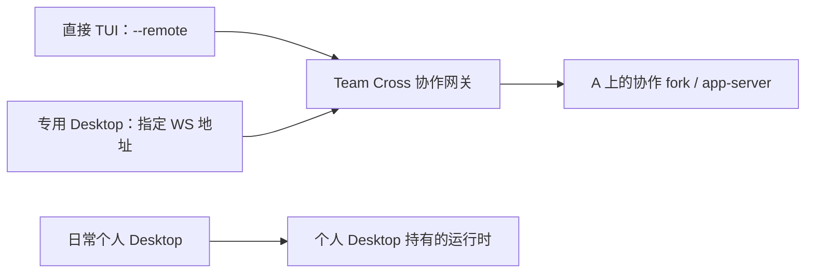

# 接收会话绑定与原生生命周期调查

日期：2026-10-05（Asia/Shanghai）。被测代码：`codex/collaboration-flow`，HEAD `ae66ff6` 加当时已有改动及本次未提交修复。没有替换运行中的已安装 App，没有重启或改写用户的原生会话。

归档说明：生命周期修复、当次回归与客户端接入澄清已完成记录；归档不表示个人 Desktop 推送或其他未覆盖路径已通过。后续方案与待验证问题保留在[活跃任务](../2026-10-05-receiver-lifecycle.md)。下文保留当时版本、环境和未覆盖项。

合入范围说明（2026-10-05）：本报告的审批通知同步、精确轮次停止、Desktop 打开检查及同源配对重试，针对 `ae66ff6` 上的未提交生命周期改动；它们不包含在 `codex/fix-receiver-deadlock` 的 `ddef6fd` 中。本次只提交调查文档，对应实现、回归文件与脚本尚未进入 Meta。下文保留当时的执行观察，不将该调查版通过结果推广为 Meta 的能力。

## 用户现场与结论

已读取用户引用的《配对当前 Team Cross 会话》和《空间协作助手》两段 Codex 会话，并核对相应 Core 日志、配对记录和原生事件。

- 配对码调用识别了正确 thread，但返回 `unsupported`；后续空间连接返回 `linked=true, receiving=false`。代理日志是默认 `app-server-control/app-server-control.sock` 不存在。个人 Desktop 使用独立 STDIO app-server，已有 daemon 代理没有接入它；“在原客户端打开后重试”的提示不能解决此路径。两次操作还生成了同源配对记录。
- 助手真实输出与工具调用已经完成。Core 事件包含两次 `serverRequest/resolved`（数字请求 ID 0、1）、`thread/status/changed=idle` 和 `turn/completed=completed`，查询返回 `busy=false`，但仍有 1 条 `mcpServer/elicitation/request` 审批。根因是 Core 没有消费原生审批解决通知，发送检查继续被旧审批阻挡。
- 同一 app-server 还能发出另一个 thread 的生命周期事件；旧实现没有按 thread 过滤，可能污染单个接收会话状态。
- 用户那一轮已完成，不能把 WebGUI 的旧审批阻塞当作轮次仍运行的证据。测试里的 `codex --remote <endpoint> agents` 能列出准确接收会话及 `Needs input`；没有把这一只读检查算作 `x` 快捷键停止成功。
- 助手收到的请求引用为空，默认指令却要求读取“所选内容”，因此报告缺少原文。无引用的空间请求现在默认梳理空间简报、确认事项和缺失信息。

## 修复范围

Core 按准确 thread 消费事件，处理数字及字符串形式的 `serverRequest/resolved`，跟踪活动 turn ID，忽略旧轮次结束对新轮次的影响。接收卡片提供停止当前轮次，使用准确 turn ID 和独立 request ID；拒绝旧轮次目标，同请求去重，等待原生完成事件解除忙碌，不伪造 Agent 完成回执。

卡片提供在 Codex Desktop 打开的入口：只读核对该 thread 的已保存轮次，使用保存的 ID 构造 `codex://threads/<id>`。空会话不会发起深链接。原生实测发现，未产生首轮的空 thread 可能还没有 rollout，过早从另一连接 resume 会返回 `missing source rollout`；验证脚本已按真实首轮开始后再连接。

配对分别报告缺失 daemon socket、目标未在 daemon 加载和其他连接失败；失败后重复连接当前会话复用已有记录，公开目标保留具体原因。**个人 Desktop 独立 STDIO app-server 的主动推送仍未实现**。没有启动额外 daemon 或恢复同一私人 thread 来冒充现有 Desktop 的接收连接。

## 执行结果

| 检查 | 结果及范围 |
| --- | --- |
| `go test ./...`、`go vet ./...` | 通过；末尾原生历史检查的补充改动另跑相关测试和 vet |
| `go test -race ./internal/collab ./internal/mcp ./internal/nativecodex` | 通过；末尾变更另跑接收生命周期相关 race 回归 |
| Web check / test / build | 通过，155 项测试；两个嵌入资源目录已更新；保留既有 Vite chunk 大小提示 |
| `TestExistingNativeDaemonConnection` | 真实隔离 daemon 通过，精确加载 ID 与独立关闭；无模型输入 |
| `verify-receiver-lifecycle.py` | 单 Mac，隔离 Core/home/workspace，Codex `0.160.0`，只使用 `gpt-5.6-luna`；结果见下方 |
| 真实浏览器 | production 资源，中文 1440/768 宽度、浅色/深色；检查审批处两项新控制及排版。英文 1024 宽度、深色截图在测试 Core 关闭后取得，只验证断线状态与缓存卡片的排版；英文另经翻译扫描与交互回归检查 |
| `git diff --check` 与本次文档路径检查 | 通过 |

最终原生回归摘要（从脚本返回值留存，不依赖临时目录才能读取）：

```json
{
  "scope": "single Mac, isolated Core/home/workspace, real native WebSocket client",
  "model": "gpt-5.6-luna",
  "nativeVersion": "codex-cli 0.160.0",
  "emptyHistoryOpenRejected": true,
  "nativeApprovalsResolved": 2,
  "availableAfterNativeCompletion": true,
  "desktopOpenArgumentsCaptured": true,
  "exactTurnInterrupted": true,
  "duplicateStopNotReplayed": true,
  "desktopSidebarRefresh": "not tested; native Desktop was not automated",
  "passed": true
}
```

两次审批均由第二个真实 WebSocket 原生客户端回应，只允许本次接收 thread、`teamcross_annotations`、精确请求 ID 及读取/完成两个工具；没有使用 Core 的审批接口掩盖通知同步问题。收到完成摘要 `NATIVE_APPROVAL_DONE` 后，Core 审批归零且空间目标恢复可发送。随后真实中断新的活动轮次，收到 `interrupted` 完成事件，并检查相同停止请求不重放。

Desktop 打开验证捕获真实 API 发出的 `open -a <测试 App> codex://threads/<准确 ID>` 参数；使用测试替身承接系统打开命令，没有控制个人 Desktop。因此该结果不证明侧边栏自动刷新，也不证明 Desktop 内继续执行接入了原来的 worker。

复现入口：调查工作树中的 `scripts/verify-receiver-lifecycle.py`、`internal/collab/receiver_lifecycle_test.go`、[Web 回归](../../../../packages/web/src/test/space-workbench.test.tsx)。本次原始临时证据保留于 `/private/tmp/teamcross-receiver-native-20261005-c/evidence/`；浏览器截图保留于仓库 `output/playwright/receiver-lifecycle/`。测试 Core、原生进程、第二客户端、TUI 及 Playwright 会话均已关闭，按测试目录检查没有残留进程。

## 调查工作树的协议与复现入口

以下扩展对应本报告的未提交工作树，尚未合入 Meta；现有正式路由仍按[协议](../../sources/protocol.md#空间工作台与独立接收会话)判断。

| 调查版扩展 | 行为 |
| --- | --- |
| `GET /space-receivers?spaceId=…` 增加 `activeTurnId` | 返回当前活动轮次 ID，供准确停止 |
| `POST /space-receivers/:id/action`，`{action:"interrupt",turnId,requestId}` | 中断精确活动轮次，同 ID 去重，等待原生完成事件 |
| 同一路由，`{action:"open-desktop"}` | 核对已保存轮次并使用保存的 thread ID 发起深链接，不接受替换目标 |

调查版 Core 回归 `internal/collab/receiver_lifecycle_test.go` 覆盖数字/字符串审批 ID、跨 thread 事件隔离、旧轮次停止拒绝、停止去重及深链接目标。复现命令为 `python3 scripts/verify-receiver-lifecycle.py --fixture-dir <新的空目录> --teamcross-bin <调查版构建> --codex-bin <Codex绝对路径>`：第二个真实 WebSocket 客户端回应精确工具审批，Core 清除待确认并恢复可发送，再验证真实中断和重复请求不重放。`--preview-seconds` 可暂停在审批处供浏览器截图，通过 fixture 的 `continue-native` 文件继续；不自动控制个人 Desktop。脚本路径和这些检查仍属于调查版，不作为当前 Meta 可直接执行的入口。

## 尚未覆盖

个人 Desktop 推送通道、无操作自动刷新侧边栏、Codex `agents` 的 `x` 快捷键实际中断、两台 Mac 网络行为均未作为本次通过结论。当前工作树修复尚未发布或安装；正在运行的旧 Core 不会因源码修改自动获得新状态处理。

## 追加澄清：现有交接与个人 Desktop 推送

追加日期：2026-10-05（Asia/Shanghai）。用户指出，当前 Team Cross 已经利用 app-server，让终端与 Desktop 交接同一会话；因此此前将“让 Desktop 和 Team Cross 连接同一个原生 app-server”列为需要调整启动方式的候选方案，容易造成现有能力尚未实现的误解。用户确认解释后，要求将完整区别记录到本 Task。本次追加只核对当前工作树中的契约和代码，未启动客户端、发送模型输入或增加验收结果。

### 已有接入机制

**用户对当前直接客户端交接的理解正确：TUI 与专用 Desktop 已有接入同一个协作运行时的实现。** 前述候选方案需要补充“日常个人 Desktop”这一限定；现有的专用 Desktop 接入不需要重新设计。

| 客户端入口 | 当前实现 | 会话与运行时关系 |
| --- | --- | --- |
| Team Cross 打开的终端 | `codex resume <协作会话 ID> --remote <Team Cross 网关地址>`；由 `nativecodex.Command` 生成 | 经网关继续操作既有协作会话，执行留在 A |
| Team Cross 打开的专用 Desktop | `ClientPlan` 使用 `open -n` 启动独立实例，设置 `CODEX_APP_SERVER_WS_URL=<网关地址>`、独立 `CODEX_HOME` 和应用数据目录 | 被明确指向与直接 TUI 相同的协作运行时 |
| “在个人 Codex 中打开” | `PersonalDesktopPlan` / `openPersonalCodex` 使用 `open -a <App> codex://threads/<ID>` | 在日常个人 Desktop 中定位已保存会话；没有指定网关、建立直接连接或改变输入归属 |

专用 Desktop 使用的是本机安装的同一个应用，但独立的实例状态和配置目录使其与日常个人 Desktop 分开。看到同一个应用名称，不能据此判断两个窗口接入了同一个运行时。共同执行使用新建的协作 fork；表中的“同一会话”指直接客户端共同操作这个 fork，不表示私人来源会话已被接管。



图示解释连接目标，不表示两个直接客户端可以同时写入。写入仍遵守同一输入归属。

### 交接具体改变什么

成员间的输入交接由 `Session.Action` 的 `handoff` / `reclaim` 分支处理：检查执行访问和运行状态，交出输入时要求当前轮次已结束，关闭旧的直接连接，更新 `writer` 与 `epoch`。会话和执行继续留在 A，交接没有把 app-server 进程迁移到接收者的 Desktop。

同一输入者选择 TUI 或专用 Desktop，是选择不同的直接客户端入口；它与成员间的输入归属交接是两个动作。`ClientPlan` 在生成启动计划前检查当前调用者持有输入权，`App.endpoint` 返回相应的网关连接入口。

### 个人会话绑定为何仍有缺口

用户此次失败的配对目标，已经在日常个人 Desktop 的独立 app-server 中运行。Team Cross 从 MCP 取得了准确 thread 身份，但当前 `ConnectExisting` 只连接提供控制 socket 的 daemon，并要求 `thread/loaded/list` 包含目标 ID。该 daemon 的接收路径没有连接到现场的个人 Desktop STDIO app-server。

因此，已有交接路径与此次绑定的区别在于连接建立的起点：前者在客户端接入时，已经明确指定 Team Cross 网关；后者需要向一个已经由个人 Desktop 持有的运行时建立外部接收连接。知道 thread ID、在历史中看到该会话或打开其深链接，都不能单独证明消息已经进入原来的运行实例。缺少 daemon socket 的现场结果只说明当前代理路径未接通，不能推导为 Desktop 原理上无法接收外部输入。

### 对候选方案的修正与复用范围

前述表格应改写为：

> Team Cross 已有让终端与专用 Desktop 共用协作 app-server 的接入机制。若要向日常个人 Desktop 的原会话推送，还需接入它现有的运行时；另一条路线是让日常 Desktop 在启动时也连接到可由 Team Cross 接入的同一个服务。

如果目标是通过 Team Cross 启动一个直接接入的 Desktop 实例，现有网关、启动计划、输入归属和原生事件路径可以作为基础。若目标坚持为日常个人 Desktop 中已经运行的原会话，则仍需解决该运行时的接收入口，不能用另建协作 fork 或第二个运行实例替代后声称原会话绑定成功。让日常 Desktop 改用指定服务属于另一种启动方式选择，本次讨论没有确定或实施该方案。

后续验证需要分别证明：准确目标会话收到并执行外部请求；Desktop 内呈现同一轮次及审批；忙碌、断线、重连与重复请求状态正确；模型和权限沿用当前会话。现有 daemon 多客户端结果、打开深链接的参数捕获，以及本段代码核对，都不能代替个人 Desktop 原会话推送验收。专用 Desktop 的启动入口已有实现，其完整界面和全局功能兼容性仍应按客户端版本实测。

### 代码与契约依据

- [原生客户端与模型设置](../../sources/decisions/native-clients-and-models.md)：直接客户端、个人辅助客户端与个人 Desktop 深链接的现有边界。
- [launch.go](../../../../internal/collab/launch.go)：`ClientPlan` 的输入权检查、TUI 启动计划、专用 Desktop 环境与隔离目录。
- [process.go](../../../../internal/nativecodex/process.go)：`Command` 的 `resume --remote` 入口，以及 `ConnectExisting` / `CheckLoaded` 的现有 daemon 接收路径。
- [network.go](../../../../internal/collab/network.go)：`Session.Action` 的输入交接与 `App.endpoint` 的网关入口。
- [personal_desktop.go](../../../../internal/collab/personal_desktop.go)：个人 Desktop 深链接打开，没有直接网关接入。
- [agent_connections.go](../../../../internal/collab/agent_connections.go) 与 [配对契约](../../sources/decisions/agent-pairing.md#当前接入范围)：当前会话连接、目标核对与未接通原因。
