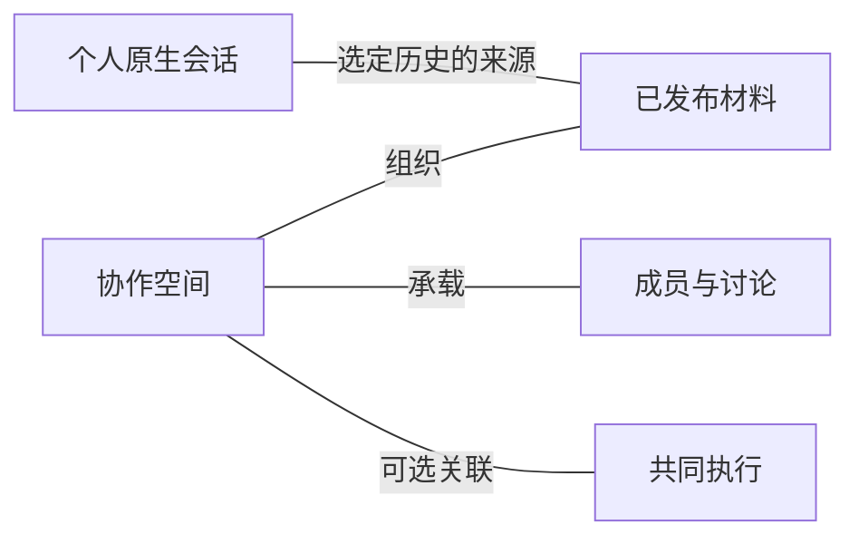

# 产品模型与词汇

Team Cross 让人和各自的 Agent 围绕协作空间分享材料、讨论，并按需共同执行。
个人原生会话保留各自的上下文；已发布材料固定共享的范围与版本，为讨论提供共同依据。

会话起点、接收用途与执行权限是不同维度。已有、新建和 fork 描述上下文来源；接收会话
描述请求目标，专用会话描述可选协调角色。参与讨论与共同操作执行现场分别管理。

- 查询定位、设计原因与总体范围 → [项目简报](../../sources/project-brief.md)。
- 查询对象定义、会话用途及原生术语 → [核心词汇](../../sources/product-core-and-glossary.md)。
- 查询用户如何分享、讨论与操作 → [产品流程](../../sources/product-flows.md)。
- 查询空间组织与专用角色 → [空间契约](../../sources/decisions/collaboration-spaces.md) / [空间工作台](../../sources/decisions/space-workbench.md)。
- 查询 fork、执行目录与保留规则 → [目录与生命周期](../../sources/decisions/workspace-and-lifecycle.md)。
