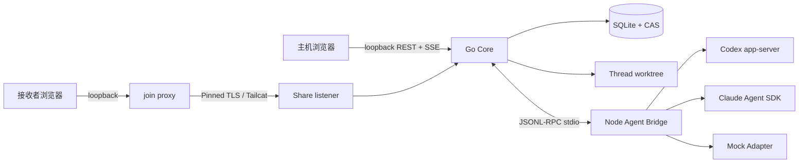

# 运行时架构

当任务会跨 CLI、HTTP、WebGUI、SQLite 或 Agent Provider 时，先读本页。

## 进程与数据流

## Go Core

Go Core 是唯一业务协调层，负责：

- CLI lifecycle 与 loopback HTTP server；
- Git capture、worktree 与 patch export；
- SQLite schema、CAS、Thread/Round/Event/Evidence；
- Share runtime、InvitationV1、SPKI gate 与过期/撤销；
- LAN、Tailscale LocalAPI、Tailcat 和 join proxy；
- Observer/Controller/Owner 权限、租约和 command idempotency；
- Bridge 进程探活、RPC 调用与 Provider event 持久化。

不要在 WebGUI 或 Node Bridge 中建立第二套 Thread、lease 或 fallback 业务规则。

## WebGUI

React WebGUI 是控制面，不是 durable source of truth：

- REST 执行 capture、annotation、evidence、Share 和 Agent 写操作；
- SSE 以 SQLite event `seq` 恢复；
- 主机和 join 模式根据 API 返回的 role/capability 隐藏不允许的操作；
- UI state 可以乐观展示，但最终 revision、lease 和 command result 来自 Go Core。

修改 `packages/web/src/` 后需要重建 `internal/webassets/dist/`，否则 Go 二进制仍会嵌入
旧界面。

## Agent Bridge

Node Bridge 是 Provider Adapter 层，不拥有 Thread durable state，也不监听协作网络。
它把不同 Provider 映射为统一 JSONL-RPC 与 event contract。Go Core 只把 Thread worktree
和显式 Run 选项交给 Bridge。

Bridge readiness 可以在业务 RPC 前探测，但运行中崩溃后不能自动推断 native Session
可恢复。

## 持久与临时状态

持久状态：Thread、Round、Git snapshot、evidence、annotation、agent run 记录、share
记录、participant、lease/command 历史、event 和 CAS object。

进程内临时状态：活跃 Share listener、证书/secret runtime、当前 join transport、Bridge
进程连接与正在运行的 native Provider client。主机重启后临时 Share 必须失效，不从数据库
伪恢复。

## 相关来源

- `../../sources/project-brief.md`
- `../../sources/decisions/immutable-rounds-and-events.md`
- `internal/server/app.go`
- `internal/server/http.go`
- `internal/bridgeclient/`
