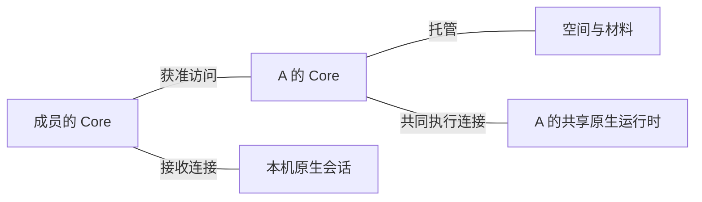

# 运行时架构

Core 管理空间、材料与访问关系，原生运行时持有模型会话并执行工具。空间托管在发起者
A 的 Core；共同执行也留在 A，各成员的个人会话与接收连接保留各自的本机归属。

```mermaid
flowchart LR
    A["A 的 Core"] ---|托管| S["空间与材料"]
    A ---|共同执行连接| R["A 的共享原生运行时"]
    B["成员的 Core"] ---|获准访问| A
    B ---|接收连接| P["本机原生会话"]
```

图中表示托管与连接关系。只读空间可以没有共享运行时，接收请求也不要求启用共同执行。
App、后台 Core、客户端连接与原生会话各有生命周期，打开一个入口不代表其他层已经就绪。

- 查询模块、存储与实际数据流 → [架构](../../sources/architecture.md)；字段与路由 → [协议](../../sources/protocol.md)。
- 查询 App/Core 发现、实例协调与退出 → [分发与首次体验](../../sources/distribution-and-onboarding.md)。
- 查询 fork、目录与恢复 → [目录与生命周期](../../sources/decisions/workspace-and-lifecycle.md)；配置继承 → [协作模式](../../sources/decisions/runtime-modes.md)。
- 查询客户端、账户与模型设置 → [原生客户端](../../sources/decisions/native-clients-and-models.md) / [Claude 接入](../../sources/decisions/claude-native-tui.md)。
- 查询成员连接与共享传输 → [输入与共享](../../sources/decisions/input-and-sharing.md)；接收连接与进程 → [配对契约](../../sources/decisions/agent-pairing.md) / [空间工作台](../../sources/decisions/space-workbench.md)。
