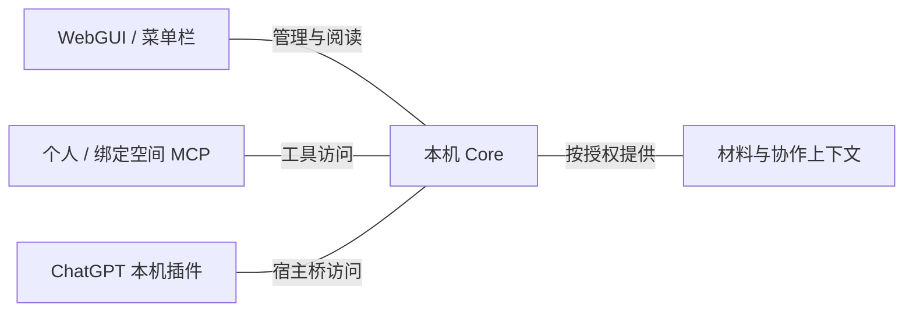

# WebGUI 与本地 MCP

WebGUI 与菜单栏面向人的管理和阅读，MCP 面向 Agent 的工具访问，ChatGPT 本机插件
复用 WebGUI。它们通过 Core 使用相同的权限与原文引用，阅读投影可以不同。

已发布材料是固定版本，执行上下文是经授权读取的活历史。个人 MCP 按本机成员范围访问，
绑定空间的工具限于对应空间；完整 Agent 对话与执行交互仍属于原生客户端。

选择引用、保存讨论、向目标发送请求与目标实际处理是不同动作。界面可用、工具能读取、
会话能接收分别依赖对应接入；辅助客户端的 Provider 与目标执行 Provider 也分别判断。

- 查询页面、发布、阅读、批注与界面语言 → [产品流程](../../sources/product-flows.md)；工具字段与分页 → [协议](../../sources/protocol.md)。
- 查询固定引用、选择清单与菜单栏速览 → [资源库契约](../../sources/decisions/resource-library.md)。
- 查询插件面板、带回对话与 mention → [本机插件契约](../../sources/decisions/chatgpt-local-plugin.md)。
- 查询接收目标、发送与回执 → [配对契约](../../sources/decisions/agent-pairing.md) / [空间工作台](../../sources/decisions/space-workbench.md)。
- 判断宿主、工具调用与真实处理的已知范围 → [证据入口](../../sources/validation/evidence-map.md)。
