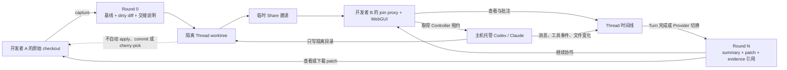
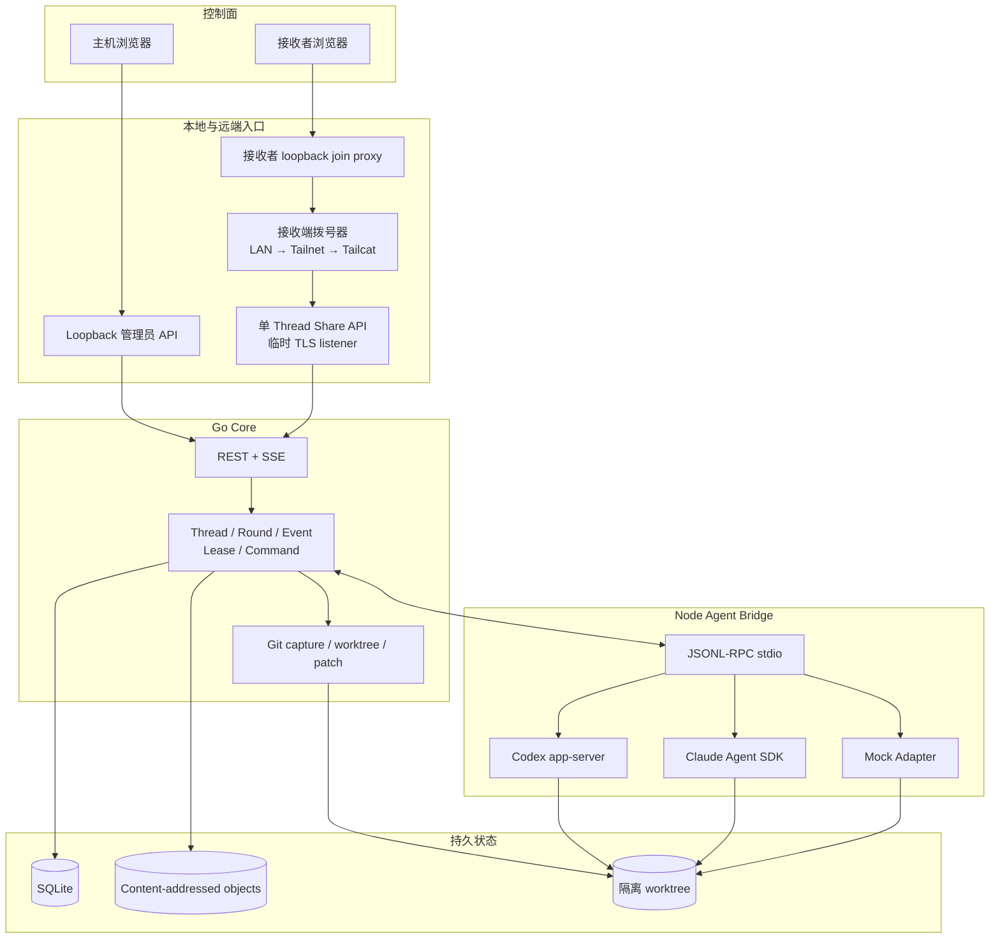
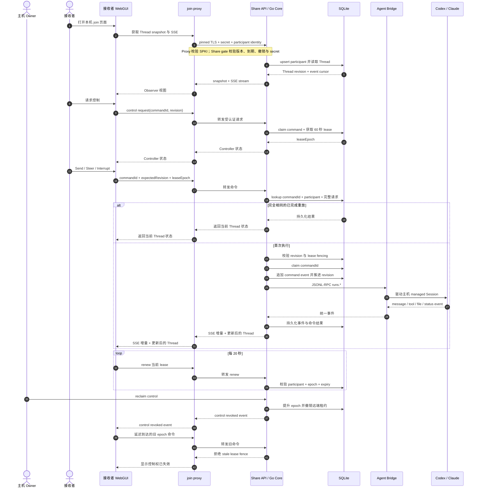

# Team Cross 产品与架构图解

本文保存当前 v0 的三张核心图：已实现闭环、技术分层和 `collaborate` 实时协作时序。
它们用于快速建立共同心智模型；协议字段和失败语义以 `docs/protocol.md` 为准，具体实现
仍以代码与测试为最终事实来源。

Team Cross 的长期产品入口是一个具体 coding-agent Session；当前 v0 则先从 Git capture
创建 Thread，再在隔离 worktree 中创建 managed Session。两者不能被写成同一项已实现
能力。Session、Thread、Run、Turn 与 Round 的规范语义和目标能力阶梯见
[产品模型与统一词汇](agent-wiki/wiki/concepts/product-model-and-glossary.md)。

## 当前 v0 闭环

这张图只描述当前已经实现的路径：一次交接从本地 dirty state 进入隔离 Thread，再由
另一位协作者批注或驱动主机 Agent，最后形成下一轮不可变快照。整个过程中，原始
checkout 不被自动写回。

关键边界：

- Share 传递的是受限 Thread 能力，不是 Shell 或整台主机权限。
- 接收者默认是 Observer；只有当前 Controller 能发送 Agent 控制命令。
- 新 Round 追加到历史，不覆盖旧 Round。
- 用户采纳结果必须是后续显式操作。

## 技术分层

这张图展示不同运行时为何同时存在，以及远端访问如何与本地管理员能力隔离。

分层原则：

- WebGUI 负责呈现和发起动作，不保存第二套 durable state。
- Go Core 是 Thread、权限、幂等、连接选择和恢复语义的唯一协调层。
- Agent Bridge 只做 Provider 协议适配，不监听协作网络。
- Share API 只暴露绑定 Thread 的能力，管理员 API 始终只在 loopback。

## `collaborate` 实时协作时序

这张图聚焦接收者从加入、观察到取得控制，再发送一条可安全重放的 Agent 命令。相同
`commandId` 的完全相同请求会返回持久化结果；新的或语义不同的请求仍要通过 revision
与 lease epoch 检查。

这个时序只表示 Team Cross 自己托管的 managed Session。已有 Codex 或 Claude 历史只能
作为带来源、不可信的 evidence 导入，不能被远端热接管。
