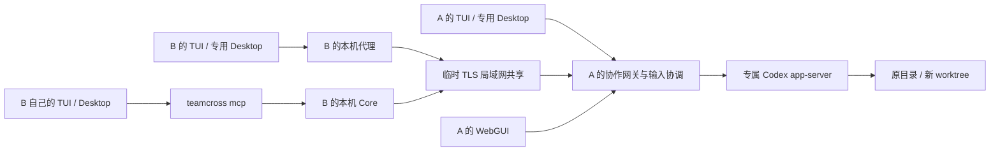

# 架构

Team Cross 管理协作的来源、执行目录、原生 fork、邀请、输入归属与人工批注。模型上下文与工具执行由 A 上的 Codex app-server 持有。



## 模块

- `internal/workspace`：Git 预览、干净 worktree、子目录映射、文件读取。
- `internal/nativecodex`：启动和初始化独立 app-server，通过一个长期 WebSocket 进行 RPC、事件及 server request 分发。
- `internal/collab`：协作记录、原生协议网关、输入协调、邀请与加入、TUI/Desktop 启动、HTTP 管理接口。
- `internal/sharing`：临时 TLS listener、指纹绑定、局域网邀请与连接。
- `internal/mcp`：本地 STDIO MCP。每次调用读取本地 Core 连接文件，服务重启后无需重新配置 MCP。
- `packages/web`：新 React/Vite 界面，生产资源编译到 `internal/webassets/dist` 后嵌入 Go 二进制。

## 原生运行时

浏览来源时按需创建只读用途的 app-server 控制连接；不会自动发送 prompt。每次协作有单独的 app-server 进程，以 A 的原生会话库读取来源并执行 fork。独立进程的配置以命令行参数覆盖，不重写 A 的个人配置。

仅复制 rollout 文件无法替代原生历史数据库。协作记录保存 `sourceId`、已确认的 `sourceTurnId` 和新 `sessionId`。创建调用 `thread/fork`，使用 `lastTurnId` 保留确认过的已完成起点。恢复调用 `thread/resume`，继续同一 ID。

直接客户端的 `initialize`、会话枚举和请求都经过协作网关。网关只暴露指定协作；固定 `threadId`、`cwd`、模型与权限 profile。网关与 MCP 共享同一个上游控制连接，避免审批只被某个连接收到而另一入口无法回应。直接客户端断开不会终止 app-server。

Desktop 使用本机安装版本的指定 WebSocket 入口，配合单独的 `CODEX_HOME` 与 Electron 数据目录，通过 `open -n` 启动。是否所有 Desktop 操作都适合远程执行需要按实际客户端版本验收；不能仅凭 app-server 协议相同宣布完整兼容。

客户端本机代理单独处理 `account/login/start`、登录完成通知、`getAuthStatus` 和客户端偏好写入。读取已有登录状态可以使用 B 的本机账户；修改账户时启动专用客户端配置的本机 app-server，避免改写 B 的普通 Codex 配置。远端共享网关不传出 A 的登录 token、MCP 配置或完整个人配置。登录路由与共享会话执行路由分别验收。

轻量历史使用 `thread/read` 的元数据与 `thread/turns/list` 分页组合，不反复要求上游加载完整历史。每页 8 轮，按时间正序返回，MCP 可用 `nextCursor` 继续读取。

## 目录与持久化

实验数据目录独立于旧产品：

```text
Team Cross Next/
  settings.json
  connection.json
  core.lock
  joined.json
  collaborations/<id>/
    collaboration.json
    runtime.log
    worktree/             # 仅 worktree 模式
  clients/<id>/
    tui/codex-home/
    desktop/codex-home/
    desktop/app-data/
```

协作 JSON 原子替换写入。`workspaceOwned` 说明目录由谁创建，`executionCwd` 统一表示实际执行子目录。原目录和新 worktree 均不在结束共享时清理。创建中断会留下错误记录与已创建资源，防止自动重试重复创建。

接收端加入记录包含邀请凭据，以本机仅用户可读文件保存；过期或撤销后不再有效。发起者的临时分享监听不持久化，重启后需重新分享。

## 输入协调与失败语义

`writer` 为 `owner` 或 `remote`；交接增加 `epoch`。所有原生和 MCP 写入先检查归属。运行中的 `turn/start` 不再接受另一轮开始；补充使用 `turn/steer`，中断使用 `turn/interrupt`。审批只接受当前输入者回应一次。

写入携带 `requestId`，记录请求哈希、`pending/completed/failed/unknown`。相同 ID、相同内容的完成请求返回已有响应；内容改变则拒绝。状态不明时先读取事件和会话结果，不能自动重发。重启后未完成写入标为 `unknown`。

当前直接客户端只有一个。交出/接回输入关闭旧直接连接；只读工具仍可读取。结束共享立即撤销访问并关闭远端直接连接，同时将输入归属还给发起者。TLS listener 短暂保留 30 秒，仅返回 `410 Gone`，让在线接收者知道共享已结束，随后关闭；Core 退出会直接关闭全部监听。

接收者持久化已经观察到的结束状态，重启后仍显示“共享已结束”；本地时间超过邀请期限时显示“邀请已到期”。未收到结束通知且主机不可达时只能判断连接中断，不能推断结束原因。重新获取邀请是恢复已关闭访问的入口。

## 范围

首轮聚焦 macOS、Codex、普通 Git 仓库和两位参与者的 LAN 协作。无强制 Round、独立 Evidence、Claude、离线包、patch/PR 发布流程。WebGUI 显示轻量上下文，完整 Agent 对话交给 Codex。
